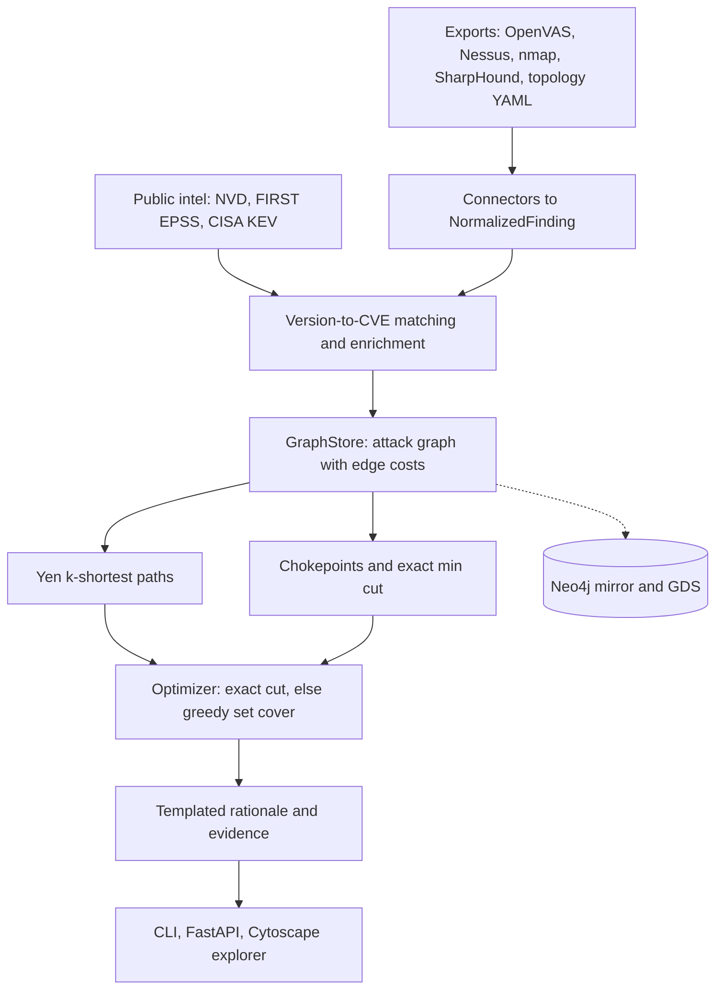

# LINCHPIN

[](https://github.com/rakshit-737/linchpin/actions/workflows/ci.yml)

[](LICENSE)
[](https://rakshit-737.github.io/linchpin/)
[](https://github.com/rakshit-737/linchpin/releases)

**Read-only attack-path reasoning: find the few fixes that cut every route to the crown jewels, using scanner, identity and exploit-intel data.**

> **Contribution, in one sentence.** LINCHPIN's contribution is evidence, not a new cut algorithm: adding identity (BloodHound) data to the scanner graph lifts the 3-fix disconnect rate from **37% [29, 45]** to **100% [97.5, 100]** of 150 seeded topologies (a KEV-then-EPSS patch queue: **3% [1, 7]**). Segmentation and exploit-intel costs do not change the disconnect rate in the ablation; they change how many fixes are needed (a flat-network view needs 1.82x the minimum on the `single` family) and the attacker-cost gain (uniform edge costs: +0.049 vs +0.193 on `none`).

| evidence | result (95% intervals) |
| --- | --- |
| [Ablation](benchmarks/results/ablation.md), 150 topologies, paired | fused data 100%; without identity data 37% (McNemar p < 1e-4); 25% / 50% of identity findings dropped: 95% / 90%; identity data only 18%; no graph (KEV->EPSS) 3% |
| [Published planners](benchmarks/results/summary.md) | the exact budgeted interdiction MILP (Israeli & Wood 2002) also reaches 100%; Guo et al.-style greedy interdiction 97% [92, 99]; CVSS / EPSS / KEV queues restricted to on-path vulns 9-10% |
| [Measured lab](benchmarks/results/lab/lab_case_study.md) (CI, internal Docker networks) | one 5-service lab: upgrading Tomcat 9.0.30 (1 fix) cuts the database off; betweenness, greedy interdiction and the MILP also need 1 fix; EPSS- and KEV-first need 2, CVSS-first 3 |
| [Published result reproduced](benchmarks/results/repro_epss.md) | Jacobs et al. (2023), EPSS v2 with public KEV labels: effort and coverage within ~2-7 points (40.8% vs 39.0% effort at CVSS 7+ coverage); efficiency does not reproduce (1.6% vs 8.9%) because KEV is a much sparser label |

LINCHPIN reads exports that were **already collected** (OpenVAS, Nessus and nmap reports, SharpHound/BloodHound JSON and a topology overlay), maps detected versions to CVEs offline, enriches them with NVD CVSS vectors, FIRST EPSS and CISA KEV, and builds a heterogeneous attack graph whose edges are attacker transitions with deterministic costs. It ranks the cheapest attack paths (Yen), finds chokepoints (dominators) and the exact minimum remediation cut (vertex max-flow), and returns an ordered, budgeted plan (patch or upgrade, rotate a credential, remove an abusable AD ACL, add a segmentation rule) in which every fix carries a templated rationale and the ids of the paths it breaks. No LLM is involved.

**Safety property:** LINCHPIN sends no packets and only parses files; it cannot exploit anything ([SECURITY.md](SECURITY.md), [THREAT_MODEL.md](THREAT_MODEL.md)). The only scanning anywhere in the project is a CI job that probes containers it starts itself on internal Docker networks, with version detection only.

**Docs:** <https://rakshit-737.github.io/linchpin/> · **Static demo:** <https://rakshit-737.github.io/linchpin/demo/> · **Preprint:** [`paper/linchpin.pdf`](paper/linchpin.pdf)

## Try it in 60 seconds

```bash
# in the browser: https://rakshit-737.github.io/linchpin/demo/  (pre-computed snapshots; nothing leaves the page)

# command line, nothing to install permanently (37 s from an empty uv cache; pip into a fresh venv: ~70 s)
uvx --from git+https://github.com/rakshit-737/linchpin linchpin synth --out lab.json
uvx --from git+https://github.com/rakshit-737/linchpin linchpin ingest --replace lab.json
uvx --from git+https://github.com/rakshit-737/linchpin linchpin fix --budget 3
# -> "host:jump-01 (segment mgmt) is the only pivot from dmz to internal; add segmentation rule isolating
#     jump-01 breaks 100/100 enumerated attack paths to ds:customer-db."

# web UI from source, bound to localhost
git clone https://github.com/rakshit-737/linchpin && cd linchpin
docker build -t linchpin . && docker run --rm -p 127.0.0.1:8000:8000 linchpin   # http://127.0.0.1:8000/ui
```


*The explorer on the real-export case study: the top fix (rotate the cached Domain-Admin credential) is selected and every attack path it breaks is highlighted.*

## Architecture



| Module | Path | Notes |
| --- | --- | --- |
| M1 connectors | `src/linchpin/connectors/` | OpenVAS, Nessus, nmap (+ `vulners`), BloodHound v5/v6 (incl. abusable ACEs and DCSync), topology overlay, native JSON; `defusedxml` |
| intel | `src/linchpin/intel/` | NVD 2.0 / EPSS / KEV parsers, 379k-CVE cache, enrichment, offline CPE version matching |
| M2 GraphStore | `src/linchpin/graph/` | in-memory NetworkX; Neo4j mirror (push/pull, `.cypher` export) and GDS Yen backend |
| M3 edge cost | `src/linchpin/engine/edge_cost.py` | frozen formula: CVSS exploitability sub-score, EPSS, KEV floor, credential reachability |
| M4 paths / cuts | `src/linchpin/engine/` | Yen k-shortest, kill-chain stages; dominator chokepoints and exact (optionally effort-weighted) min cut |
| M5 optimizer / M6 explain | `src/linchpin/engine/` | exact cut when it fits the budget, else greedy set cover; templated rationales |
| M7 API / M10 UI | `src/linchpin/api/` | FastAPI (localhost, host allow-list, size limits) and a static Cytoscape.js explorer |
| M8 CLI | `src/linchpin/cli.py` | `ingest`, `scenario`, `paths`, `fix`, `cuts`, `whatif`, `export`, `neo4j-push`, `serve` |
| M9 synth | `src/linchpin/synth/` | four seeded topology families with real CVE parameters and ground truth |
| M11 ML | `src/linchpin/ml/` | learned exploit likelihood (KEV labels known at the cutoff, exploitation-status text masked) |

Contracts are frozen in [`contracts/`](contracts/) and only change additively (v1.1 KEV and sub-score inputs, v1.2 ACE edges and `fix_cost`, v1.3 credential reachability). How every stage works: [docs/how-it-works](https://rakshit-737.github.io/linchpin/how-it-works/).

## Results

Every number below comes from a committed result file in [`benchmarks/results/`](benchmarks/results/); methods, all tables and threats to validity are on the [Evaluation](https://rakshit-737.github.io/linchpin/evaluation/) page, commands and runtimes on [Reproduce](https://rakshit-737.github.io/linchpin/reproduce/).

| evaluation | headline |
| --- | --- |
| Synthetic benchmark, 4 families x 50 seeds, budget 3 | 100% disconnected where a 3-fix cut exists (150 topologies); score queues 3-4%, on-path variants 9-10%, betweenness 39%; on average 69% [63, 76] of the enumerated paths are broken by LINCHPIN but not by CVSS-first |
| No cut within budget (`none`) | 0.83 [0.77, 0.88] of the optimal rise in the attacker's cheapest-path cost (exact MILP), KEV->EPSS 0.15 |
| Ablation | identity data is decisive (37% without it, p < 1e-4); the exact cut changes how many fixes are needed (greedy 1.22x on `multi`), uniform edge costs cut the `none` cost gain from +0.193 to +0.049 |
| Measured CI lab | 5 services detected, 393 CVEs (7 in KEV) by NVD version range; 1 fix (Tomcat upgrade) cuts the database off; betweenness, greedy and MILP tie at 1 fix (n=1 lab, 23-node graph) |
| Real-export case study | one credential rotation cuts the domain controller off; enriched CVSS / EPSS / KEV queues with 3 fixes do not |
| EPSS reproduction (Jacobs et al. 2023) | effort and coverage reproduce within ~2-7 points (CVSS 7+ effort 58.2% vs 58.1%); efficiency does not (1.6% vs 8.9%: KEV is sparser than the paper's telemetry); prospective KEV label: EPSS v2 53% [42, 65] vs CVSS 9.1+ 29% [18, 42] coverage at 15% effort, intervals overlap (62 positives) |
| M11 learned exploitability (leak-free test set) | ROC-AUC 0.836 vs 0.754 for CVSS; average precision 0.028 vs 0.011 |
| Neo4j GDS (CI) | identical Yen paths on 60k and 239k relationships; 4-31x faster inside Neo4j, mirroring costs 8-22 s |
| Performance (laptop, median of 5) | 1.1 s at 467 nodes, 3.1 s at 903, 7.0 s at 1,384 (spec: < 5 s at 500 nodes) |

### Measured case study (CI lab scan)

The `lab-scan` CI job starts official images pinned to older releases (httpd 2.4.49, nginx 1.16.1, tomcat 9.0.30, redis 5.0.7, mysql 5.5.62) on two networks created with `--internal`, runs `nmap -sV` (no NSE scripts, no exploitation) from a scanner container inside each network against those containers only, derives segments and firewall rules from what each vantage point saw, maps versions to CVEs with the packaged offline index, and plans. It fails if the scans contain script output, if fewer than 3 versions are detected, if no KEV CVE maps, or if LINCHPIN's plan does not cut the database off or needs more fixes than a baseline.

| strategy | first fix | DB cut off after 1 fix? | fixes needed |
| --- | --- | :---: | ---: |
| **LINCHPIN** | upgrade tomcat 9.0.30 on `app` (the only DMZ-to-core pivot) | **yes** | **1** |
| Exact interdiction MILP / greedy interdiction | mysql 5.5.62 on `db` / tomcat on `app` | yes | 1 |
| EPSS-first, KEV-then-EPSS | httpd 2.4.49 on `web` | no | 2 |
| CVSS-first | redis 5.0.7 on `cache` (CVSS 9.9; on 5 of the 10 paths, the direct app-to-db route remains) | no | 3 |

Scans from CI run [36999203784](https://github.com/rakshit-737/linchpin/actions/runs/36999203784) are committed in [`benchmarks/results/lab/`](benchmarks/results/lab/); replay with `linchpin scenario scenarios/lab_scan.yaml --data-dir .`. A version banner is not proof of exposure, so the CVE lists are an upper bound.

### Synthetic benchmark and ablation


The four families span zero, one and several chokepoints; every planted vuln uses the NVD vector, sub-score, EPSS and KEV status of a real CVE from a KEV-enriched sample ([`src/linchpin/synth/data/cve_pool.csv`](src/linchpin/synth/data/cve_pool.csv), 10% KEV against 0.5% in the population). Each family also plants unreachable KEV decoys and high-CVSS non-RCE noise, which is why the score queues are also run restricted to on-path vulnerabilities. LINCHPIN's 100% is guaranteed by max-flow / min-cut wherever a 3-fix cut exists; the comparison measures how far other planners are from that optimum inside the model ([summary](benchmarks/results/summary.md), [ablation](benchmarks/results/ablation.md)).

### Reproduction of a published result

[Jacobs et al. (IEEE EuroS&P Workshops 2023)](https://doi.org/10.1109/EuroSPW59978.2023.00027) report coverage, efficiency and effort of CVSS and EPSS thresholds. On the population they used (CVEs published by 2022-12-01 with an NVD CVSS v3 score), with the EPSS scores actually published on that date (EPSS v2) and CISA KEV as the public label, effort and coverage reproduce within ~2-7 points, but efficiency does not (1.6% vs 8.9% at CVSS 7+ coverage) because KEV (854 positives) is a much sparser label than the paper's exploitation telemetry; the "one-eighth of the effort" headline uses EPSS v3, which was not published before March 2023 and is not reproducible from public data. Details, the circularity of scoring EPSS against KEV, and a prospective label: [`repro_epss.md`](benchmarks/results/repro_epss.md).

| paper-like population, EPSS v2, KEV label | ours: effort / coverage / efficiency % | paper |
| --- | --- | --- |
| CVSS 7+ | 58.2 / 89.6 / 1.1 | 58.1 / 82.1 / 3.9 |
| EPSS, coverage matched to CVSS 7+ | 40.8 / 90.0 / 1.6 | 39.0 / 84.7 / 8.9 |
| CVSS 9.1+ | 15.0 / 31.6 / 1.5 | 15.1 / 33.5 / 6.1 |
| EPSS, effort matched to CVSS 9.1+ | 15.1 / 71.4 / 3.4 | 15.4 / 69.9 / 18.5 |


### Real-export case study (declared topology)

Real OpenVAS, Greenbone, Nessus and nmap exports plus the SharpHound `TESTLAB.LOCAL` collection, enriched with NVD / EPSS / KEV and placed into a **declared** topology ([`scenarios/composite_lab.yaml`](scenarios/composite_lab.yaml)): 135 findings (119 exported + 16 from the overlay), 128 nodes, 224 edges. LINCHPIN's single fix (rotate the cached `ADMINISTRATOR@TESTLAB.LOCAL` hash) cuts the domain controller off; CVSS-, EPSS- and KEV-sorted queues with 3 fixes do not. Without NVD / EPSS / KEV enrichment the EPSS and KEV queues happen to pick the app-server RCE and succeed too ([`case_study.md`](benchmarks/results/case_study.md)).

### Learned exploitability (M11)

A hashed bag of description n-grams, CVSS vector components and CWE ids in a class-balanced logistic regression, trained on CVEs published 2015-2022 with the KEV labels known at the cutoff, with sentences that report exploitation status masked from the text. On CVEs published from 2023 whose description does not report exploitation: ROC-AUC 0.836 [0.820, 0.852] vs 0.754 for CVSS base score, average precision 0.028 vs 0.011 (about 2.4x; the v1.0 setup, with today's labels and unmasked text, reported 0.863 / 0.063). EPSS is a reference only: it uses exploitation telemetry and KEV itself ([`ml_exploitability.md`](benchmarks/results/ml_exploitability.md)).

## Datasets

`python scripts/download_data.py` fetches about 270 MB into `../../datasets/linchpin/`, outside the repo, verifying commit-pinned and archived files by SHA-256 before use and NVD feeds against NVD's published `.meta` hashes. Nothing downloaded is committed.

| dataset | use | licence / terms |
| --- | --- | --- |
| [NVD CVE JSON 2.0](https://nvd.nist.gov/vuln/data-feeds) 2002-2026 (379,082 CVEs) | CVSS vectors, sub-scores, CWE, descriptions, CPE version ranges | US-gov public domain. *This product uses data from the NVD API but is not endorsed or certified by the NVD.* |
| [FIRST EPSS](https://www.first.org/epss/) scores of 2026-09-25 and of 2022-12-01 | exploitation probability; the reproduction | free use with attribution |
| [CISA KEV](https://www.cisa.gov/known-exploited-vulnerabilities-catalog) catalog 2026.09.25 | known-exploited floor, labels | CC0 / public domain |
| [DefectDojo](https://github.com/DefectDojo/django-DefectDojo) unit-test scans @ `a8fd87f` | real OpenVAS, Nessus and nmap exports | BSD-3-Clause |
| [SpecterOps BloodHound](https://github.com/SpecterOps/BloodHound) v6 fixtures @ `ca1be93` | real SharpHound identity layer | Apache-2.0 |

## Quickstart

```bash
git clone https://github.com/rakshit-737/linchpin && cd linchpin
pip install -e ".[dev,api,ml,bench]"      # distribution "linchpin-attackpath"; the command is `linchpin`
python -m pytest -q                       # real-data, live-Neo4j and browser tests auto-skip without data / server / Chromium

linchpin synth --hosts 20 --seed 0 --out data/synth.json   # seeded topology, real CVE parameters
linchpin ingest --replace data/synth.json
linchpin fix --budget 3
linchpin cuts --weighted
linchpin whatif --remove jump-01

# your own lab exports: a scenario ties exports, topology (with `match:` host aliases) and intel together
linchpin intel-build --data-dir ../../datasets/linchpin
linchpin scenario scenarios/composite_lab.yaml --data-dir ../../datasets/linchpin
linchpin paths --k 5 --explain
linchpin ingest --replace --match-cpe nmap-sV.xml topology.yaml   # or: versions -> CVEs offline

linchpin serve                             # API + web UI on http://127.0.0.1:8000/ui
```

Do not `pip install linchpin` from PyPI: that name belongs to an unrelated project. Release images are on `ghcr.io/rakshit-737/linchpin`; v1.0.0 has known issues ([SECURITY.md](SECURITY.md)), use a later one.

## Prior art and how this differs

- **Attack graphs and minimum-cost hardening.** Attack-graph generation (Phillips & Swiler 1998; Sheyner et al. 2002; MulVAL, Ou et al. 2005) and choosing a minimum set of fixes that disconnects it (Noel et al. 2003; Wang, Noel & Jajodia 2006; Albanese, Jajodia & Noel 2012) are classical, and so is budgeted blocking of Active Directory attack graphs (Heat-ray, Dunagan et al. 2009; Guo et al. 2022, 2023). LINCHPIN's cut is a textbook vertex max-flow (Ford & Fulkerson 1956); it claims no new algorithm.
- **What it adds:** fusion of real exports (vulnerability scanners, SharpHound identity data, a topology overlay, offline version matching) with public exploit intel in one deterministic, inspectable graph; fix plans that carry their evidence; and an open, seeded evaluation: an ablation that isolates which data makes plans work, published-method baselines (the Israeli & Wood interdiction MILP, a Guo-style greedy), a measured lab built and scanned in CI, and a reproduction of a published prioritisation result.
- **BloodHound / BloodHound CE:** shortest paths over AD identity edges. LINCHPIN ingests SharpHound data and fuses it with vulnerability, service and segmentation data, then ranks *fixes*.
- **Commercial exposure management** (XM Cyber, Tenable One, Wiz attack paths): the same "choke point" idea, closed-source.
- **CVSS / EPSS / SSVC / KEV-first prioritisation** scores each finding in isolation; LINCHPIN uses those scores only inside the edge cost.

## Limitations

- **Scored inside the model.** The benchmark measures plans on LINCHPIN's own attack graph and topology families; LINCHPIN's 100% is guaranteed wherever the minimum cut fits the budget. This is not a measurement of real-world risk.
- **Declared topology** in the real-export case study; the measured lab is small (5 containers) and declares which network faces the internet and where the crown jewel is.
- **Version banners are not proof** of exposure (backports and configuration are invisible), so matched CVE lists are an upper bound.
- **Simplified semantics.** Code execution is inferred from CVSS vectors; ADCS, shadow credentials, GPO links and trusts are not modelled; credential use is penalised, not blocked, when its target is unreachable.
- **Proxy labels.** KEV stands in for exploitation in the wild; EPSS uses KEV as an input.
- **Residual paths are k-capped**; disconnect rate and cost gain are reported for that reason.
- **No cut within budget:** the greedy fallback reaches about 83% of the optimal attacker-cost rise.
- **Scale:** about 3 s at 900 nodes, 7 s at 1,400 on a laptop; the GDS backend is faster only when the graph already lives in Neo4j.

Full list: [docs/limitations](https://rakshit-737.github.io/linchpin/limitations/).

## Roadmap

- Use the exact interdiction MILP as the optimiser's fallback when no cut fits the budget
- ADCS / shadow-credential / GPO edges
- A larger measured lab (Active Directory in containers, more segments)
- Measured per-organisation remediation costs for the weighted cut

## References

Phillips & Swiler, NSPW 1998, [doi:10.1145/310889.310919](https://doi.org/10.1145/310889.310919) · Sheyner et al., IEEE S&P 2002, [doi:10.1109/SECPRI.2002.1004377](https://doi.org/10.1109/SECPRI.2002.1004377) · Ou, Govindavajhala & Appel, USENIX Security 2005, pp. 113-128 · Noel et al., ACSAC 2003, [doi:10.1109/CSAC.2003.1254313](https://doi.org/10.1109/CSAC.2003.1254313) · Wang, Noel & Jajodia, Computer Communications 2006, [doi:10.1016/j.comcom.2006.06.018](https://doi.org/10.1016/j.comcom.2006.06.018) · Albanese, Jajodia & Noel, DSN 2012, [doi:10.1109/DSN.2012.6263942](https://doi.org/10.1109/DSN.2012.6263942) · Dunagan, Zheng & Simon, SOSP 2009, [doi:10.1145/1629575.1629605](https://doi.org/10.1145/1629575.1629605) · Guo et al., AAAI 2022, [doi:10.1609/aaai.v36i9.21167](https://doi.org/10.1609/aaai.v36i9.21167) · Guo et al., AAAI 2023, [doi:10.1609/aaai.v37i5.25701](https://doi.org/10.1609/aaai.v37i5.25701) · Israeli & Wood, Networks 2002, [doi:10.1002/net.10039](https://doi.org/10.1002/net.10039) · Ford & Fulkerson 1956, [doi:10.4153/CJM-1956-045-5](https://doi.org/10.4153/CJM-1956-045-5) · Yen 1971, [doi:10.1287/mnsc.17.11.712](https://doi.org/10.1287/mnsc.17.11.712) · Jacobs et al., DTRAP 2021, [doi:10.1145/3436242](https://doi.org/10.1145/3436242) · Jacobs et al., IEEE EuroS&PW 2023, [doi:10.1109/EuroSPW59978.2023.00027](https://doi.org/10.1109/EuroSPW59978.2023.00027). Full list with statistics references: [docs/datasets](https://rakshit-737.github.io/linchpin/datasets/#references).

## Lab-only safety note

Use LINCHPIN only on data from systems you own or are explicitly authorised to assess. It performs no scanning or exploitation, and anything it ingests must already have been collected lawfully. The bundled sample exports describe public test targets (Metasploitable, `testphp.vulnweb.com`, a BloodHound test domain); do not use them as a reason to probe those or any other hosts. The CI lab scans only containers that the job itself starts on internal Docker networks.

Licence: [MIT](LICENSE). Citation: [CITATION.cff](CITATION.cff). Contributions: [CONTRIBUTING.md](CONTRIBUTING.md). Changes: [CHANGELOG.md](CHANGELOG.md).
