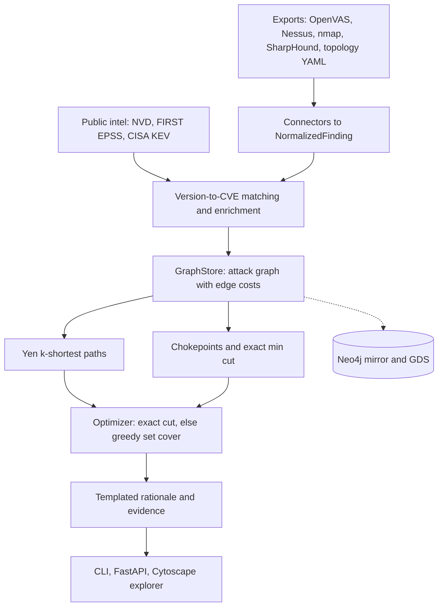

# LINCHPIN

[](https://github.com/rakshit-737/linchpin/actions/workflows/ci.yml)

[](LICENSE)
[](https://rakshit-737.github.io/linchpin/)
[](https://github.com/rakshit-737/linchpin/releases)

**Read-only attack-path reasoning: find the few fixes that cut every route to the crown jewels, using scanner, identity and exploit-intel data.**

> **Contribution.** Inside its seeded attack-graph model, LINCHPIN measures which data a fix plan needs: on synthetic topologies whose routes run through cached credentials, adding identity (BloodHound) data lifts 3-fix disconnection from 5/100 to 100/100.

| claim | result [95% interval] | paired test | source | run / commit |
| --- | --- | --- | --- | --- |
| Identity data decides whether 3 fixes cut credential-routed topologies off (ablation, `ad` + `multi`, n = 100) | with it 100/100 [96, 100]; without it 5/100 [2, 11]; identity data alone 27/100 [19, 36] | exact McNemar, 95 vs 0 discordant, p < 1e-4 | [ablation.md](benchmarks/results/ablation.md) | CI [37089520295](https://github.com/rakshit-737/linchpin/actions/runs/37089520295) |
| Published planners reach the same rate (`single` + `multi` + `ad`, n = 150) | exact interdiction MILP (Israeli & Wood 2002) 100% [98, 100]; Guo et al.-style greedy interdiction 97% [92, 99]; best patch-only plan 95% [90, 97] | vs LINCHPIN: 0 vs 0 (p = 1), 5 vs 0 (p = 0.0625), 8 vs 0 (p = 0.0078) | [summary.md](benchmarks/results/summary.md) | CI [37089520295](https://github.com/rakshit-737/linchpin/actions/runs/37089520295) |
| Score-sorted patch queues do no better than chance (n = 150) | CVSS / EPSS / KEV-then-EPSS queues over on-path vulns 10% [6, 16] / 9% [6, 15] / 9% [6, 15]; 3 fixes drawn uniformly from all remediable nodes 10% [6, 16]; betweenness 39% [31, 47] | vs random: 10 vs 10, 9 vs 10, 9 vs 10 (p = 1 each); betweenness 46 vs 3 (p < 1e-4) | [summary.md](benchmarks/results/summary.md) | CI [37089520295](https://github.com/rakshit-737/linchpin/actions/runs/37089520295) |
| Measured lab: 5 outdated images scanned inside CI on internal Docker networks (n = 1 lab) | upgrading Tomcat 9.0.30 (1 fix) cuts the database off; betweenness, greedy interdiction and the MILP also need 1 fix; EPSS- and KEV-first 2, CVSS-first 3 | none (one lab) | [lab_case_study.md](benchmarks/results/lab/lab_case_study.md) | CI [37091866743](https://github.com/rakshit-737/linchpin/actions/runs/37091866743) |
| Partial replication of Jacobs et al. (2023) with public data (EPSS v2, KEV as label; 117,141 of their ~191k CVEs) | effort within 2 points in all four rows, coverage within 1.5-7.5 points; effort ratio EPSS / CVSS 7+ at equal coverage 0.701 [0.695, 0.824] vs the paper's 0.671 (outside the interval); efficiency does not reproduce (1.6% vs 8.9%) | - | [repro_epss.md](benchmarks/results/repro_epss.md) | commit 22b77b5 (local; data hashes in the file) |
| Prospective label: the 62 CVEs added to KEV in the following year | at 14.9% effort EPSS v2 covers 33/62 = 53% [41, 65], CVSS 9.1+ 18/62 = 29% [19, 41] | 20 vs 5 discordant, exact McNemar p = 0.0041; difference +24.2 points, paired bootstrap [9.7, 38.7] | [repro_epss.md](benchmarks/results/repro_epss.md) | commit 22b77b5 |

These are results inside LINCHPIN's model: the topology families were written for this project, and the identity result is built into them (only `ad` and `multi` route through cached credentials; pooled with `single`, where identity cannot matter, the rate without identity data is 37% [29, 45]). LINCHPIN itself disconnects 100% of the 150 topologies by construction, because it returns the exact minimum cut whenever that fits the budget.

LINCHPIN reads exports that were **already collected** (OpenVAS, Nessus and nmap reports, SharpHound/BloodHound JSON and a topology overlay), maps detected versions to CVEs offline, enriches them with NVD CVSS vectors, FIRST EPSS and CISA KEV, and builds a heterogeneous attack graph whose edges are attacker transitions with deterministic costs. It ranks the cheapest attack paths (Yen), finds chokepoints (dominators) and the exact minimum remediation cut (vertex max-flow), and returns an ordered, budgeted plan (patch or upgrade, rotate a credential, remove an abusable AD ACL, add a segmentation rule) in which every fix carries a templated rationale and the ids of the paths it breaks. No LLM is involved.

**Safety property:** LINCHPIN sends no packets and only parses files; it cannot exploit anything ([SECURITY.md](SECURITY.md), [THREAT_MODEL.md](THREAT_MODEL.md)). The only scanning anywhere in the project is a CI job that probes containers it starts itself on internal Docker networks, with version detection only.

**Docs:** <https://rakshit-737.github.io/linchpin/> · **Static demo:** <https://rakshit-737.github.io/linchpin/demo/> · **Preprint:** [`paper/linchpin.pdf`](paper/linchpin.pdf) (CI fails if it differs from a fresh build of the LaTeX source)

## Try it in 60 seconds

```bash
# in the browser: https://rakshit-737.github.io/linchpin/demo/  (pre-computed snapshots; nothing leaves the page)

# command line: install the v1.1.1 release once with uv, then run it
uv tool install git+https://github.com/rakshit-737/linchpin@v1.1.1
linchpin synth --out lab.json
linchpin ingest --replace lab.json
linchpin fix --budget 3
# -> "host:jump-01 (segment mgmt) is the only pivot from dmz to internal; add segmentation rule isolating
#     jump-01 breaks 100/100 enumerated attack paths to ds:customer-db."

# web UI from source, bound to localhost
git clone https://github.com/rakshit-737/linchpin && cd linchpin
docker build -t linchpin . && docker run --rm -p 127.0.0.1:8000:8000 linchpin   # http://127.0.0.1:8000/ui
```


*The explorer on the real-export case study: the top fix (rotate the cached Domain-Admin credential) is selected and every attack path it breaks is highlighted.*

## Architecture



| Module | Path | Notes |
| --- | --- | --- |
| M1 connectors | `src/linchpin/connectors/` | OpenVAS, Nessus, nmap (+ `vulners`), BloodHound v5/v6 (incl. abusable ACEs and DCSync), topology overlay, native JSON; `defusedxml` |
| intel | `src/linchpin/intel/` | NVD 2.0 / EPSS / KEV parsers, 379k-CVE cache, enrichment, offline CPE version matching |
| M2 GraphStore | `src/linchpin/graph/` | in-memory NetworkX; Neo4j mirror (push/pull, `.cypher` export) and GDS Yen backend |
| M3 edge cost | `src/linchpin/engine/edge_cost.py` | frozen formula: CVSS exploitability sub-score, EPSS, KEV floor, credential reachability |
| M4 paths / cuts | `src/linchpin/engine/` | Yen k-shortest, kill-chain stages; dominator chokepoints and exact (optionally effort-weighted) min cut |
| M5 optimizer / M6 explain | `src/linchpin/engine/` | exact cut when it fits the budget, else greedy set cover; templated rationales |
| M7 API / M10 UI | `src/linchpin/api/` | FastAPI (localhost, host allow-list, size limits, no framing) and a static Cytoscape.js explorer |
| M8 CLI | `src/linchpin/cli.py` | `ingest`, `scenario`, `paths`, `fix`, `cuts`, `whatif`, `export`, `neo4j-push`, `serve` |
| M9 synth | `src/linchpin/synth/` | four seeded topology families with real CVE parameters and ground truth |
| M11 ML | `src/linchpin/ml/` | learned exploit likelihood (KEV labels known at the cutoff, exploitation-status text masked) |

Contracts are frozen in [`contracts/`](contracts/) and only change additively (v1.1 KEV and sub-score inputs, v1.2 ACE edges and `fix_cost`, v1.3 credential reachability). How every stage works: [docs/how-it-works](https://rakshit-737.github.io/linchpin/how-it-works/).

## More results

Every number comes from a committed file in [`benchmarks/results/`](benchmarks/results/), which records the commit or CI run that produced it; methods, all tables and threats to validity are on the [Evaluation](https://rakshit-737.github.io/linchpin/evaluation/) page, commands and runtimes on [Reproduce](https://rakshit-737.github.io/linchpin/reproduce/). The CI re-run of the benchmark and the ablation (run 37089520295, Linux) reproduced every outcome cell of the earlier Windows run.

| evaluation | result [95% interval], paired test | source | run / commit |
| --- | --- | --- | --- |
| No cut within budget (`none`, n = 50) | LINCHPIN's greedy fallback reaches 0.83 [0.77, 0.88] of the optimal (MILP) rise in the attacker's cheapest-path cost, KEV-then-EPSS 0.15 [0.09, 0.22]; paired gain difference +0.156 [0.130, 0.182] (LINCHPIN larger in 46, smaller in 0 topologies; sign test p < 1e-4) | [summary.md](benchmarks/results/summary.md) | CI 37089520295 |
| Ablation: how many fixes | planning on a flat-network view needs 1.82x [1.72, 1.92] the minimum on `single`; every CVE as code execution 1.10x [1.02, 1.20] on `ad`; greedy without the exact cut 1.22x [1.14, 1.31] on `multi` | [ablation.md](benchmarks/results/ablation.md) | CI 37089520295 |
| Ablation: exploit-intel edge costs (`none`) | scored with the intel costs, the fused plan's cost gain beats the uniform-cost plan's by +0.144 [0.119, 0.168] (46 vs 3, p < 1e-4); scored with uniform costs the order reverses, -0.054 [-0.082, -0.027] (4 vs 20, p = 0.0015). The gap reflects agreement between planning and scoring costs, not evidence that the intel helps | [ablation.md](benchmarks/results/ablation.md) | CI 37089520295 |
| Attack paths left after 3 fixes | difference in the share of enumerated (k-capped) paths left, CVSS-first minus LINCHPIN: 92 percentage points [88, 96] over the 150 topologies with a 3-fix cut (`ad` 81%, `multi` 98%, `single` 98%; `none` 0, both full) | [summary.md](benchmarks/results/summary.md) | CI 37089520295 |
| Real-export case study (declared topology) | one credential rotation cuts the domain controller off, and the interdiction MILP, greedy interdiction and betweenness also do within 3 fixes; enriched CVSS / EPSS / KEV queues with 3 fixes do not. Planned without the identity findings (the ablation's `no_identity` view), LINCHPIN sees no attack path at all and proposes no fix, while the domain controller stays reachable (200/200 enumerated paths). | [case_study.md](benchmarks/results/case_study.md) | commit e26d0b1 |
| M11 learned exploitability (label and phrase leakage removed; CVEs from 2023, n = 177,629, 631 in KEV) | ROC-AUC 0.836 [0.820, 0.852] vs 0.754 [0.739, 0.772] for the CVSS base score; average precision 0.028 [0.024, 0.034] vs 0.011 [0.010, 0.014]. Paired on the same resampled CVEs: AUC difference +0.082 [0.065, 0.100], average-precision ratio 2.43x [1.90, 3.24]. | [ml_exploitability.md](benchmarks/results/ml_exploitability.md), [ml_paired.md](benchmarks/results/ml_paired.md) | commits 552d969 (model), 094ef62 (paired) |
| Neo4j GDS (CI) | identical costs and path sets on graphs of 60,040 and 238,665 relationships; Yen inside Neo4j is 4.8x / 8.1x faster at 250 hosts (k = 10 / 100) and 39x / 12x at 500 hosts (medians of 10 timed runs; 1.4-39x across the four CI runs that measured it), but mirroring the graph into Neo4j takes 5-15 s | [gds_crosscheck.json](benchmarks/results/gds_crosscheck.json) | CI [37091866743](https://github.com/rakshit-737/linchpin/actions/runs/37091866743) |
| Performance (laptop, median of 5) | 1.1 s at 467 nodes, 3.1 s at 903, 7.0 s at 1,384 (spec: < 5 s at 500 nodes) | [scale.json](benchmarks/results/scale.json) | commit bbf492e |

### Measured case study (CI lab scan)

The `lab-scan` CI job starts official images pinned to older releases (httpd 2.4.49, nginx 1.16.1, tomcat 9.0.30, redis 5.0.7, mysql 5.5.62; the pulled digests are recorded in `versions.txt`) on two networks created with `--internal`, runs `nmap -sV` (no NSE scripts, no exploitation) from a scanner container inside each network against those containers only, derives segments and firewall rules from what each vantage point saw, maps versions to CVEs with the packaged offline index, and plans. It fails if the scans contain script output, if fewer than 3 versions are detected, if no KEV CVE maps, or if LINCHPIN's plan does not cut the database off or needs more fixes than a baseline.

| strategy | first fix | DB cut off after 1 fix? | fixes needed |
| --- | --- | :---: | ---: |
| **LINCHPIN** | upgrade tomcat 9.0.30 on `app` (the only DMZ-to-core pivot) | **yes** | **1** |
| Exact interdiction MILP / greedy interdiction | mysql 5.5.62 on `db` / tomcat on `app` | yes | 1 |
| EPSS-first, KEV-then-EPSS | httpd 2.4.49 on `web` | no | 2 |
| CVSS-first | redis 5.0.7 on `cache` (CVSS 9.9; on 5 of the 10 paths, the direct app-to-db route remains) | no | 3 |

The `lab-scan` job re-runs on every push ([workflow](https://github.com/rakshit-737/linchpin/actions/workflows/ci.yml)); the scans, derived topology, analysis and image digests committed in [`benchmarks/results/lab/`](benchmarks/results/lab/) are the artefact of CI run [37091866743](https://github.com/rakshit-737/linchpin/actions/runs/37091866743) (5 of 6 services matched, 393 CVEs, 7 in KEV); replay with `linchpin scenario scenarios/lab_scan.yaml --data-dir .`. A version banner is not proof of exposure, so the CVE lists are an upper bound.

### Synthetic benchmark and ablation


The four families span zero, one and several chokepoints; every planted vuln uses the NVD vector, sub-score, EPSS and KEV status of a real CVE from a KEV-enriched sample ([`src/linchpin/synth/data/cve_pool.csv`](src/linchpin/synth/data/cve_pool.csv), 10% KEV against 0.5% in the population). Each family also plants unreachable KEV decoys and high-CVSS non-RCE noise, which is why the score queues are also run restricted to on-path vulnerabilities. The score queues may only patch, while LINCHPIN may also segment a host or rotate a credential; the *best patch-only plan* (LINCHPIN's planner restricted to vulnerabilities) is the like-for-like ceiling for them: 95% [90, 97] against their 9-10%. LINCHPIN's 100% is guaranteed by max-flow / min-cut wherever a 3-fix cut exists; the comparison measures how far other planners are from that optimum inside the model ([summary](benchmarks/results/summary.md), [ablation](benchmarks/results/ablation.md)).

### Partial replication of a published result

[Jacobs et al. (IEEE EuroS&P Workshops 2023)](https://doi.org/10.1109/EuroSPW59978.2023.00027) report coverage, efficiency and effort of CVSS and EPSS thresholds. Their population is about 191k CVEs: 118,087 with an NVD CVSS v3 score plus 73,327 v2-only CVEs whose v3 vectors they imputed with their own model. We use the part we can rebuild, the 117,141 CVEs published by 2022-12-01 with an NVD v3 score, the EPSS scores actually published on that date (EPSS v2) and CISA KEV as the public label. Effort reproduces within 2 points in all four rows and coverage within 1.5-7.5 points (CVSS 7+ coverage 89.6% vs 82.1%; the EPSS row is matched to our own CVSS 7+ coverage of about 90%, not the paper's 82-85%). The effort ratio at equal coverage is 0.701 [0.695, 0.824] against the paper's 0.671 for EPSS v2, which lies outside our interval. Efficiency does not reproduce (1.6% vs 8.9% at CVSS 7+ coverage) because KEV (854 positives) is a much sparser label than the paper's exploitation telemetry, and the "one-eighth of the effort" headline uses EPSS v3, which was not published before March 2023. Every transcribed paper cell was checked against the arXiv v2 PDF ([record](benchmarks/results/repro_epss_paper_check.md)). Details, the possible circularity of scoring EPSS against KEV, and the prospective label: [`repro_epss.md`](benchmarks/results/repro_epss.md).

| paper-like population, EPSS v2, KEV label | ours: effort / coverage / efficiency % | paper |
| --- | --- | --- |
| CVSS 7+ | 58.2 / 89.6 / 1.12 | 58.1 / 82.1 / 3.9 |
| EPSS, coverage matched to CVSS 7+ | 40.8 / 90.0 / 1.61 | 39.0 / 84.7 / 8.9 |
| CVSS 9.1+ | 15.0 / 31.6 / 1.53 | 15.1 / 33.5 / 6.1 |
| EPSS, effort matched to CVSS 9.1+ | 15.1 / 71.4 / 3.45 | 15.4 / 69.9 / 18.5 |

### Secondary case study: real export, declared topology (superseded by the measured lab above)

Real OpenVAS, Greenbone, Nessus and nmap exports plus the SharpHound `TESTLAB.LOCAL` collection, enriched with NVD / EPSS / KEV and placed into a **declared** topology ([`scenarios/composite_lab.yaml`](scenarios/composite_lab.yaml)): 135 findings (119 exported + 16 from the overlay), 128 nodes, 224 edges. LINCHPIN's single fix (rotate the cached `ADMINISTRATOR@TESTLAB.LOCAL` hash) cuts the domain controller off; so do the interdiction MILP, greedy interdiction and betweenness within 3 fixes, while CVSS-, EPSS- and KEV-sorted queues with 3 fixes do not. Planned without the identity findings (the ablation's `no_identity` view), LINCHPIN sees no attack path at all and proposes no fix, while the domain controller stays reachable (200/200 enumerated paths). Without NVD / EPSS / KEV enrichment the EPSS and KEV queues happen to pick the app-server RCE and succeed too ([`case_study.md`](benchmarks/results/case_study.md)).

### Learned exploitability (M11)

A hashed bag of description n-grams, CVSS vector components and CWE ids in a class-balanced logistic regression, trained on CVEs published 2015-2022 with the KEV labels known at the cutoff, with sentences that report exploitation status masked from the text (label and phrase leakage removed; the features still come from today's NVD record). On CVEs published from 2023 whose description does not report exploitation: ROC-AUC 0.836 [0.820, 0.852] vs 0.754 [0.739, 0.772] for the CVSS base score, average precision 0.028 [0.024, 0.034] vs 0.011 [0.010, 0.014]. Paired on the same resampled CVEs: AUC difference +0.082 [0.065, 0.100], average-precision ratio 2.43x [1.90, 3.24]. The v1.0 setup, with today's labels and unmasked text, reported 0.863 / 0.063. EPSS is a reference only: it uses exploitation telemetry and KEV itself ([`ml_exploitability.md`](benchmarks/results/ml_exploitability.md), [`ml_paired.md`](benchmarks/results/ml_paired.md)).

## Datasets

`python scripts/download_data.py` fetches about 270 MB into `../../datasets/linchpin/`, outside the repo, verifying commit-pinned and archived files by SHA-256 before use and NVD feeds against NVD's published `.meta` hashes. Nothing downloaded is committed.

| dataset | use | licence / terms |
| --- | --- | --- |
| [NVD CVE JSON 2.0](https://nvd.nist.gov/vuln/data-feeds) 2002-2026 (379,082 CVEs) | CVSS vectors, sub-scores, CWE, descriptions, CPE version ranges | US-gov public domain. *This product uses data from the NVD API but is not endorsed or certified by the NVD.* |
| [FIRST EPSS](https://www.first.org/epss/) scores of 2026-09-25 and of 2022-12-01 | exploitation probability; the reproduction | free use with attribution |
| [CISA KEV](https://www.cisa.gov/known-exploited-vulnerabilities-catalog) catalog 2026.09.25 | known-exploited floor, labels | CC0 / public domain |
| [DefectDojo](https://github.com/DefectDojo/django-DefectDojo) unit-test scans @ `a8fd87f` | real OpenVAS, Nessus and nmap exports | BSD-3-Clause |
| [SpecterOps BloodHound](https://github.com/SpecterOps/BloodHound) v6 fixtures @ `ca1be93` | real SharpHound identity layer | Apache-2.0 |

## Quickstart

```bash
git clone https://github.com/rakshit-737/linchpin && cd linchpin
pip install -e ".[dev,api,ml,bench]"      # distribution "linchpin-attackpath"; the command is `linchpin`
python -m pytest -q                       # real-data, live-Neo4j and browser tests auto-skip without data / server / Chromium

linchpin synth --hosts 20 --seed 0 --out data/synth.json   # seeded topology, real CVE parameters
linchpin ingest --replace data/synth.json
linchpin fix --budget 3
linchpin cuts --weighted
linchpin whatif --remove jump-01

# real exports: a scenario ties exports, topology (with `match:` host aliases) and intel together
linchpin intel-build --data-dir ../../datasets/linchpin
linchpin scenario scenarios/composite_lab.yaml --data-dir ../../datasets/linchpin
linchpin paths --k 5 --explain

# nmap -sV versions -> CVEs offline (here the committed CI lab scans; use your own XML and topology.yaml)
linchpin ingest --replace --match-cpe benchmarks/results/lab/scan-lp-dmz.xml benchmarks/results/lab/scan-lp-core.xml benchmarks/results/lab/topology.yaml

linchpin serve                             # API + web UI on http://127.0.0.1:8000/ui
```

Do not `pip install linchpin` from PyPI: that name belongs to an unrelated project. Release images are on `ghcr.io/rakshit-737/linchpin`; v1.0.0 has known issues ([SECURITY.md](SECURITY.md)), use 1.1.0 or later.

## Prior art and how this differs

- **Attack graphs and minimum-cost hardening.** Attack-graph generation (Phillips & Swiler 1998; Sheyner et al. 2002; MulVAL, Ou et al. 2005) and choosing a minimum set of fixes that disconnects it (Noel et al. 2003; Wang, Noel & Jajodia 2006; Albanese, Jajodia & Noel 2012) are classical, and so is budgeted blocking of Active Directory attack graphs (Heat-ray, Dunagan et al. 2009; Guo et al. 2022, 2023). LINCHPIN's cut is a textbook vertex max-flow (Ford & Fulkerson 1956); it claims no new algorithm.
- **Fusing scanner and network data into attack graphs** is also established: TVA (Jajodia, Noel & O'Berry 2005), NetSPA (Ingols, Lippmann & Piwowarski 2006) and CyGraph (Noel et al. 2016, in Neo4j) combine vulnerability scans with firewall and topology data.
- **What it adds:** the Active Directory identity layer (SharpHound sessions, credentials and abusable ACEs) fused with scanner, segmentation and public exploit intel in one deterministic, inspectable graph; fix plans that carry their evidence; and an open, seeded evaluation: an ablation that isolates which data makes plans work, published-method baselines (the Israeli & Wood interdiction MILP, a Guo-style greedy), a measured lab built and scanned in CI, and a partial replication of a published prioritisation result.
- **BloodHound / BloodHound CE:** shortest paths over AD identity edges. LINCHPIN ingests SharpHound data and fuses it with vulnerability, service and segmentation data, then ranks *fixes*.
- **Commercial exposure management** (XM Cyber, Tenable One, Wiz attack paths): the same "choke point" idea, closed-source.
- **CVSS / EPSS / SSVC / KEV-first prioritisation** scores each finding in isolation; LINCHPIN uses those scores only inside the edge cost.

## Limitations

- **Scored inside the model.** The benchmark measures plans on LINCHPIN's own attack graph and topology families; LINCHPIN's 100% is guaranteed wherever the minimum cut fits the budget. This is not a measurement of real-world risk.
- **The identity result is designed into the families**: `ad` and `multi` route through cached credentials by construction, `single` does not. It is a within-model result, not a population rate.
- **Exploit-intel costs** change the attacker-cost gain only when plans are scored with those same costs; with uniform scoring costs the order reverses.
- **Declared topology** in the real-export case study; the measured lab is small (5 containers) and declares which network faces the internet and where the crown jewel is.
- **Version banners are not proof** of exposure (backports and configuration are invisible), so matched CVE lists are an upper bound.
- **Simplified semantics.** Code execution is inferred from CVSS vectors; ADCS, shadow credentials, GPO links and trusts are not modelled; credential use is penalised, not blocked, when its target is unreachable.
- **Proxy labels.** KEV stands in for exploitation in the wild; EPSS v3 uses KEV as an input (likely, but not documented, for the v2 scores used here).
- **Residual paths are k-capped**; disconnect rate and cost gain are reported for that reason.
- **No cut within budget:** the greedy fallback reaches about 83% of the optimal attacker-cost rise.
- **Scale:** about 3 s at 900 nodes, 7 s at 1,400 on a laptop; the GDS backend is faster only when the graph already lives in Neo4j.

Full list: [docs/limitations](https://rakshit-737.github.io/linchpin/limitations/).

## Roadmap

- Use the exact interdiction MILP as the optimiser's fallback when no cut fits the budget
- ADCS / shadow-credential / GPO edges
- A larger measured lab (Active Directory in containers, more segments)
- Measured per-organisation remediation costs for the weighted cut

## References

Phillips & Swiler, NSPW 1998, [doi:10.1145/310889.310919](https://doi.org/10.1145/310889.310919) · Sheyner et al., IEEE S&P 2002, [doi:10.1109/SECPRI.2002.1004377](https://doi.org/10.1109/SECPRI.2002.1004377) · Ou, Govindavajhala & Appel, USENIX Security 2005, pp. 113-128 · Noel et al., ACSAC 2003, [doi:10.1109/CSAC.2003.1254313](https://doi.org/10.1109/CSAC.2003.1254313) · Jajodia, Noel & O'Berry, Managing Cyber Threats 2005, [doi:10.1007/0-387-24230-9_9](https://doi.org/10.1007/0-387-24230-9_9) · Wang, Noel & Jajodia, Computer Communications 2006, [doi:10.1016/j.comcom.2006.06.018](https://doi.org/10.1016/j.comcom.2006.06.018) · Ingols, Lippmann & Piwowarski, ACSAC 2006, [doi:10.1109/ACSAC.2006.39](https://doi.org/10.1109/ACSAC.2006.39) · Albanese, Jajodia & Noel, DSN 2012, [doi:10.1109/DSN.2012.6263942](https://doi.org/10.1109/DSN.2012.6263942) · Noel et al., CyGraph, Handbook of Statistics 2016, [doi:10.1016/bs.host.2016.07.001](https://doi.org/10.1016/bs.host.2016.07.001) · Dunagan, Zheng & Simon, SOSP 2009, [doi:10.1145/1629575.1629605](https://doi.org/10.1145/1629575.1629605) · Guo et al., AAAI 2022, [doi:10.1609/aaai.v36i9.21167](https://doi.org/10.1609/aaai.v36i9.21167) · Guo et al., AAAI 2023, [doi:10.1609/aaai.v37i5.25701](https://doi.org/10.1609/aaai.v37i5.25701) · Israeli & Wood, Networks 2002, [doi:10.1002/net.10039](https://doi.org/10.1002/net.10039) · Ford & Fulkerson 1956, [doi:10.4153/CJM-1956-045-5](https://doi.org/10.4153/CJM-1956-045-5) · Yen 1971, [doi:10.1287/mnsc.17.11.712](https://doi.org/10.1287/mnsc.17.11.712) · Jacobs et al., DTRAP 2021, [doi:10.1145/3436242](https://doi.org/10.1145/3436242) · Jacobs et al., IEEE EuroS&PW 2023, [doi:10.1109/EuroSPW59978.2023.00027](https://doi.org/10.1109/EuroSPW59978.2023.00027). Full list with statistics references: [docs/datasets](https://rakshit-737.github.io/linchpin/datasets/#references).

## Lab-only safety note

Use LINCHPIN only on data from systems you own or are explicitly authorised to assess. It performs no scanning or exploitation, and anything it ingests must already have been collected lawfully. The bundled sample exports describe public test targets (Metasploitable, `testphp.vulnweb.com`, a BloodHound test domain); do not use them as a reason to probe those or any other hosts. The CI lab scans only containers that the job itself starts on internal Docker networks.

Licence: [MIT](LICENSE). Citation: [CITATION.cff](CITATION.cff). Contributions: [CONTRIBUTING.md](CONTRIBUTING.md). Changes: [CHANGELOG.md](CHANGELOG.md).
