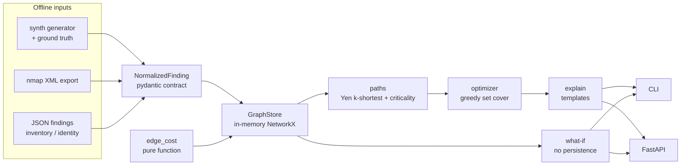

# LINCHPIN

**Read-only attack-path reasoning and remediation prioritisation.**

> A CVSS-10 on an unreachable host is correctly deprioritised; two CVSS-4s that chain to the crown jewels are ranked #1.

LINCHPIN takes vulnerability, host, identity and network facts that were **already collected** from an isolated lab or produced by its synthetic-enterprise generator. It builds a heterogeneous attack graph where each edge is a possible attacker transition with a deterministic cost. From that graph it:

1. enumerates and ranks attacker paths from entry points to crown jewels (Yen's k-shortest paths), and
2. picks the smallest set of fixes (patch, rotate a credential, add a segmentation rule) that breaks the most crown-jewel paths, using greedy set cover with a graph-cut tie-break.

Each recommendation includes a templated plain-English rationale and the ids of the paths it breaks as evidence. No LLM is involved.

**Safety property:** LINCHPIN cannot exploit anything. It has no network code, sends no packets, and only reads exported files. See [SECURITY.md](SECURITY.md) and [THREAT_MODEL.md](THREAT_MODEL.md).

## Architecture



The frozen contracts are in [`contracts/`](contracts/): the finding JSON schema, the graph model, the OpenAPI surface, the edge-cost formula and the config schema.

| Module | Path | Status |
| --- | --- | --- |
| M1 connectors | `src/linchpin/connectors/` | nmap XML and native JSON done; OpenVAS and Nessus are TODO |
| M2 GraphStore | `src/linchpin/graph/store.py` | in-memory NetworkX; Neo4j backend is TODO |
| M3 edge cost | `src/linchpin/engine/edge_cost.py` | done |
| M4 paths + criticality | `src/linchpin/engine/paths.py` | done |
| M5 optimizer | `src/linchpin/engine/optimizer.py` | done |
| M6 explanations | `src/linchpin/engine/explain.py` | done |
| M7 API | `src/linchpin/api/app.py` | done (optional extra) |
| M8 CLI | `src/linchpin/cli.py` | done (argparse) |
| M9 synthetic generator | `src/linchpin/synth/generator.py` | done |
| benchmark | `src/linchpin/benchmark.py`, `benchmarks/` | done |
| M10 React UI | none | TODO |
| M11 learned exploitability | none | TODO (optional) |

## Quickstart

```bash
pip install -e ".[dev]"      # or: pip install -r requirements.txt
make test                    # pytest
make demo                    # synth -> ingest -> build -> paths -> fix -> what-if
make bench                   # ranking vs CVSS over 100 synthetic topologies
make api                     # FastAPI on 127.0.0.1:8000 (docs at /docs)
```

Without `make`, set `PYTHONPATH=src` and run the CLI directly:

```bash
python -m linchpin synth --hosts 20 --seed 0 --out data/synth.json
python -m linchpin ingest --replace data/synth.json
python -m linchpin paths --k 3 --explain
python -m linchpin fix --budget 3
python -m linchpin whatif --remove jump-01
```

Example output of `fix`: `host:jump-01 (segment mgmt) is the only pivot from dmz to internal; add segmentation rule isolating jump-01 breaks 100/100 enumerated attack paths to ds:customer-db.`

## Benchmark (synthetic, sanity-level)

`make bench` runs 100 seeded topologies with a budget of 2 fixes. Each residual count is the number of paths still found, capped at k=100.

| metric | value |
| --- | --- |
| optimizer top-1 = planted linchpin | 100/100 |
| mean residual paths, LINCHPIN order | 0 |
| mean residual paths, CVSS-sorted order | 94.7 |
| mean reduction vs CVSS (fraction of enumerated paths) | 0.95 ± 0.17 |

**Caveat:** the generator deliberately plants one linchpin and an unreachable CVSS-10 decoy. This result shows the machinery works on a topology built to test it. It does not show performance on real networks. Randomised topologies with multiple or no cuts are TODO.

## Prior art & how this differs

- **MulVAL, NetSPA, and the attack-graph literature (Sheyner et al.):** logical or model-checked attack graphs. LINCHPIN uses a much simpler cost-weighted graph. What it adds is remediation *optimisation* with a templated rationale and evidence for each fix.
- **BloodHound:** shortest paths over AD identity edges. LINCHPIN combines vulnerability, service, network-segmentation and credential data in one graph, and ranks fixes rather than only showing paths.
- **Commercial exposure management (XM Cyber, Tenable/Wiz attack paths):** similar "choke point" idea, but closed-source. LINCHPIN is small, deterministic and inspectable, and ships a reproducible synthetic benchmark with ground truth.
- **CVSS/EPSS prioritisation:** scores each finding in isolation. LINCHPIN uses CVSS/EPSS only as one term of the edge cost and ranks fixes by how many attack paths they break.

Not claimed: completeness of the attack model, real-world accuracy, or scale beyond a few hundred nodes (a 560-node graph builds, ranks and optimises in about 1.5 s on a laptop).

## Known gaps / TODO

- **Grade B:** Neo4j `GraphStore` backend (with a testcontainers test); OpenVAS and Nessus parsers with golden files; React + Cytoscape path explorer (M10) with Playwright smoke test.
- **Grade C:** learned exploitability model (M11) trained on public EPSS/NVD data; running real OpenVAS/Nessus/nmap against your own isolated lab VMs to produce test exports.
- **Grade D:** validating cost weights and skill penalties against expert judgment; building richer synthetic topologies (multiple cuts, AD tiers, cloud IAM).
- **Model limitations:** `prerequisite_match` is fixed at 1.0. Credential reuse ignores whether the attacker can reach the target host over the network. Reachability is modelled per segment, not per host firewall rule. Only `AdminTo` ACLs are modelled.

## Lab-only safety note

Use LINCHPIN only on data from systems you own or are explicitly authorised to assess, such as a host-only lab network or the built-in synthetic generator. It performs no scanning or exploitation. Anything it ingests must already have been collected lawfully. CVE ids in synthetic data are labels on fictional nodes.
