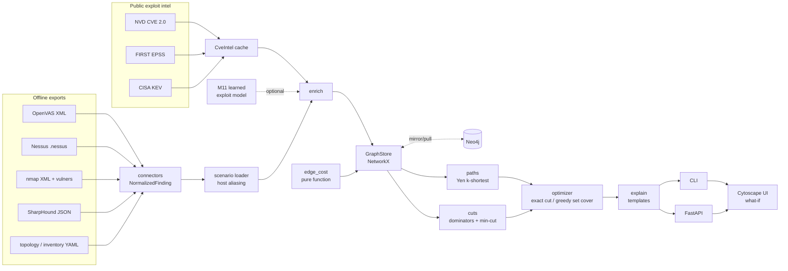
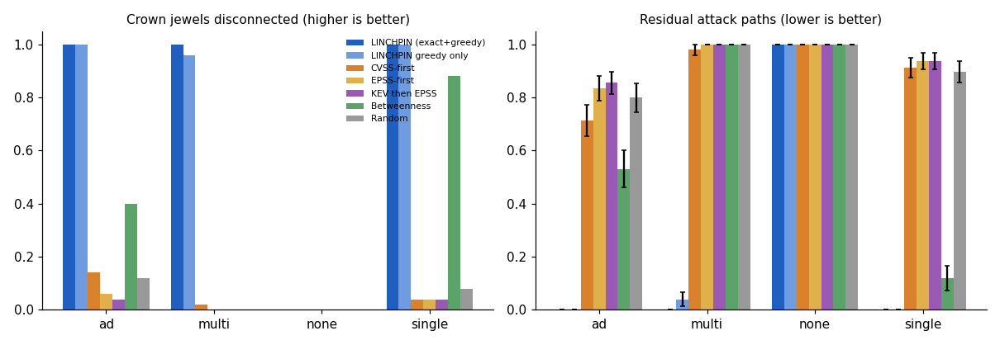
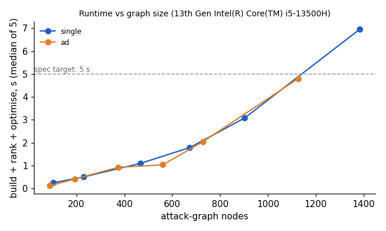

# LINCHPIN

[](https://github.com/rakshit-737/linchpin/actions/workflows/ci.yml)

[](LICENSE)
[](https://rakshit-737.github.io/linchpin/)
[](https://github.com/rakshit-737/linchpin/releases)

**Read-only attack-path reasoning: find the few fixes that cut every route to the crown jewels, using scanner, identity and exploit-intel data.**

> A CVSS-10 on an unreachable host is correctly deprioritised. A cached Domain-Admin hash that every attack path needs is ranked #1.

LINCHPIN reads exports that were **already collected**: OpenVAS, Nessus and nmap reports, SharpHound/BloodHound JSON, and a topology/inventory overlay. It enriches them with real exploitability data (NVD CVSS vectors, FIRST EPSS, CISA KEV) and builds a heterogeneous attack graph. Each edge is a possible attacker transition with a deterministic cost. From that graph it:

1. enumerates and ranks entry-to-crown-jewel attack paths (Yen's k-shortest paths),
2. finds **chokepoints** (dominators) and the **exact minimum remediation cut** (vertex max-flow/min-cut), by fix count or by remediation effort (`cuts --weighted`),
3. recommends an ordered, budgeted set of fixes (patch, rotate a credential, remove an abusable AD ACL, add a segmentation rule). Each fix comes with a templated rationale and the ids of the paths it breaks as evidence. No LLM is involved,
4. serves all of this through a CLI, a FastAPI service, a Cytoscape.js path explorer with live what-if analysis, and an optional Neo4j mirror.

**Docs:** <https://rakshit-737.github.io/linchpin/> · **Static demo (runs in the browser):** <https://rakshit-737.github.io/linchpin/demo/> · **Image:** `docker run --rm -p 127.0.0.1:8000:8000 ghcr.io/rakshit-737/linchpin`

**Safety property:** LINCHPIN cannot exploit anything. It sends no packets and only parses files. See [SECURITY.md](SECURITY.md) and [THREAT_MODEL.md](THREAT_MODEL.md).


*The web UI on the real-export case study. The top remediation (rotate the cached Domain-Admin credential) is selected, and every attack path it breaks is highlighted.*

## Architecture



| Module | Path | Notes |
| --- | --- | --- |
| M1 connectors | `src/linchpin/connectors/` | OpenVAS, Nessus, nmap (+ `vulners` CVEs), BloodHound v5/v6 (incl. abusable ACEs and DCSync), inventory overlay, native JSON. Format auto-detection; `defusedxml` parsing |
| intel | `src/linchpin/intel/` | NVD 2.0 / EPSS / KEV parsers, 379k-CVE lookup cache, finding enrichment |
| scenario | `src/linchpin/scenario.py` | real exports + declared topology + intel in one YAML |
| M2 GraphStore | `src/linchpin/graph/store.py`, `neo4j_store.py` | in-memory NetworkX; Neo4j mirror (push/pull, `.cypher` export) |
| M3 edge cost | `src/linchpin/engine/edge_cost.py` | frozen formula; uses the CVSS exploitability sub-score and a KEV floor |
| M4 paths | `src/linchpin/engine/paths.py` | Yen k-shortest, kill-chain stages, criticality |
| cuts | `src/linchpin/engine/cuts.py` | chokepoints (dominator tree) and exact min vertex cut, unweighted or effort-weighted |
| M5 optimizer | `src/linchpin/engine/optimizer.py` | exact min cut when it fits the budget, otherwise greedy set cover |
| M6 explain | `src/linchpin/engine/explain.py` | deterministic templates |
| M7 API | `src/linchpin/api/app.py` | frozen endpoints plus `/graph`, `/chokepoints`, `/demo/load`, `/ui` |
| M8 CLI | `src/linchpin/cli.py` | `ingest`, `scenario`, `intel-build`, `paths`, `fix`, `cuts`, `whatif`, `export`, `neo4j-push` |
| M9 synth | `src/linchpin/synth/` | four topology families that use real CVE parameters |
| M10 UI | `src/linchpin/api/static/index.html` | Cytoscape.js path explorer, remediation table, what-if |
| M11 ML | `src/linchpin/ml/exploitability.py` | KEV-membership model from NVD text and vectors, trained on a temporal split |

Contracts are frozen in [`contracts/`](contracts/). v1.1 changes are additive: the `cvss_exploitability` and `kev` edge-cost inputs, plus `exploitability_source` in the config. v1.2 adds the `Ace` node, `HAS_ACE` / `ABUSES` edges, the `acl_abuse` skill class and `fix_cost` ([ADR 0004](docs/adr/0004-ace-edges-weighted-cut.md)). Design notes are in [`docs/`](docs/).

## Results

All numbers below come from runs in this repo, reproducible with the commands in [Reproducibility](#reproducibility).

### 1. Real-export case study ([`scenarios/composite_lab.yaml`](scenarios/composite_lab.yaml))

The **findings and exploit intel are real.** The inputs are an OpenVAS scan of Metasploitable 2, a Greenbone report for a Windows Server 2019 host, a Nessus scan of the deliberately vulnerable `testphp.vulnweb.com`, two nmap exports, and the SharpHound collection of the `TESTLAB.LOCAL` domain. The CVEs are enriched with NVD, EPSS (2026-09-25) and KEV. **The topology is declared:** the exports come from unrelated networks, so the YAML places them into one plausible enterprise layout and adds one service-account credential.

| | |
| --- | --- |
| findings | 135 from 6 exports; 43 of 69 vuln findings carry an NVD CVE (the rest are CVE-less checks); 2 are in KEV |
| attack graph | 128 nodes, 224 edges (incl. 3 abusable-ACE nodes, none reachable from the entry points); 33 of 69 vulns grant code execution (from the CVSS vector) |
| crown jewel | NTDS on the domain controller `primary.testlab.local` (from BloodHound) |
| chokepoints | Windows app-server RCE, `app-win`, `svc_deploy`, `win10`, cached `ADMINISTRATOR` hash |

| strategy (budget 3) | fixes chosen | DC cut off? | residual paths (k=200) |
| --- | --- | :---: | ---: |
| **LINCHPIN** | rotate cached `ADMINISTRATOR@TESTLAB.LOCAL` (1 fix) | **yes** | **0** |
| CVSS-first | 3 × CVSS 10 findings on the DMZ web boxes | no | 200 |
| EPSS-first | 3 highest-EPSS DMZ findings | no | 200 |
| KEV → EPSS | KEV PHP-CGI RCE (CVE-2012-1823) + 2 more DMZ findings | no | 200 |
| Betweenness | DMZ vuln, then app-server RCE and host | yes | 0 |

> *Credential ADMINISTRATOR@TESTLAB.LOCAL is recoverable on win10.testlab.local and grants admin on 4 host(s) …; rotate credential ADMINISTRATOR@TESTLAB.LOCAL (remove cached copies) breaks 200/200 enumerated attack paths to ds:ntds@primary.testlab.local.*

Full output: [`benchmarks/results/case_study.md`](benchmarks/results/case_study.md).

### 2. Benchmark: 4 topology families × 50 seeds, real CVE parameters

Every planted vuln is drawn from [`benchmarks/data/cve_pool.csv`](benchmarks/data/cve_pool.csv). That file is a seeded sample of 3,000 real CVEs (300 in KEV) with their NVD vector, exploitability sub-score, EPSS and KEV status. The CVSS, EPSS and KEV baselines therefore rank realistic score distributions. The families span the brief's "multiple or zero chokepoints" cases:

* `single`: one bastion between the DMZ and everything else.
* `multi`: 2–3 parallel bastions and two independent routes into the DB. No single cut exists; the minimum cut is 2.
* `none`: flat network where the DB exposes several RCEs. The minimum cut is about 7 fixes, well over the budget.
* `ad`: tiered AD with helpdesk local-admin reuse and server-admin and DA sessions cached on lower tiers. Half the seeds add a KEV RCE on the DC.

Graphs have 12–60 hosts (≈90–300 nodes). The budget is **3 fixes**. "Disconnect" means no crown jewel is reachable afterwards.

| family (exact min cut) | LINCHPIN | greedy only | CVSS-first | EPSS-first | KEV → EPSS | betweenness | random |
| --- | ---: | ---: | ---: | ---: | ---: | ---: | ---: |
| single (1.0) | **100%** | 100% | 4% | 4% | 4% | 88% | 8% |
| ad (1.38; 62% have a chokepoint) | **100%** | 100% | 14% | 6% | 4% | 40% | 12% |
| multi (2.0; no chokepoint) | **100%** | 96% | 2% | 0% | 0% | 0% | 0% |
| none (7.1) | 0% | 0% | 0% | 0% | 0% | 0% | 0% |

Re-run for v1.0 with 95% intervals (Wilson for rates, seeded bootstrap for cost gain); the numbers are unchanged from v0.2. With n = 50 per family, a 100% rate has the interval [93%, 100%]. The strongest baseline's intervals: betweenness 88% [76%, 94%] on `single` and 40% [28%, 54%] on `ad`; CVSS-first 14% [7%, 26%] on `ad`. On `none`, LINCHPIN's cost gain is +0.207 [+0.187, +0.229] against +0.063 [+0.044, +0.083] for KEV→EPSS.



* **When no plan within budget can disconnect** (`none`), LINCHPIN still raises the attacker's cheapest-path cost the most: +0.207 in edge-cost units, against +0.023 for CVSS-first, +0.063 for KEV→EPSS and +0.046 for betweenness.
* **Optimality:** greedy set cover alone needs 1.00×, 1.00×, 1.17× and 1.34× the exact minimum cut (single, ad, multi, none). That is why the default optimizer runs the max-flow cut first and falls back to greedy only when the cut exceeds the budget.
* **Strong baseline, stated plainly:** plain betweenness centrality is a good heuristic when a single bastion exists (88%). It fails once pivots are parallel or identity-based (0–40%).

Details: [`benchmarks/results/summary.md`](benchmarks/results/summary.md) and the per-topology rows in `rows.csv`.

### 3. M11 learned exploitability (temporal split)

The label is CISA KEV membership. The model trains on NVD CVEs published 2015–2022 (124,943 CVEs, 883 in KEV) and tests on CVEs published from 2023 on (177,922 CVEs, 691 in KEV, base rate 0.39%). It is a hashed bag of description n-grams, CVSS vector components and CWE ids, fed to a class-balanced logistic regression. EPSS is not a feature.

| scorer | ROC-AUC [95% CI] | avg. precision [95% CI] |
| --- | ---: | ---: |
| CVSS base score | 0.748 [0.731, 0.766] | 0.012 [0.011, 0.015] |
| CVSS exploitability sub-score | 0.594 [0.574, 0.617] | 0.006 [0.005, 0.006] |
| **LINCHPIN learned** | **0.863 [0.850, 0.875]** | **0.063 [0.049, 0.080]** |
| FIRST EPSS (reference only\*) | 0.967 [0.960, 0.972] | 0.376 [0.339, 0.412] |

CIs: class-stratified bootstrap, 200 replicates, seed 0. The learned model's AUC interval does not overlap CVSS base score's.

\* The EPSS scores are dated 2026-09-25, after most test CVEs were exploited, and EPSS consumes exploitation telemetry. Treat it as an upper reference, not a baseline this model claims to beat. The learned score improves on CVSS by about 5× in average precision. It is useful where EPSS is missing, for example for brand-new CVEs, and it is opt-in via `exploitability_source: learned`.

### 4. Performance



On a laptop (i5-13500H), build + rank (k=10) + optimise (budget 5, k=100) takes **0.7 s at 467 nodes** / 9.8k edges (`single`) and **2.0 s at 373 nodes** (`ad`). At about 900 nodes and 38k edges it takes 5–6 s, so the spec's "<5 s at 500 nodes" target is met. The exact min cut adds 0.2–1.5 s in that range. See `benchmarks/results/scale.json`.

## Datasets

`python scripts/download_data.py` fetches about 270 MB into `../../datasets/linchpin/`, outside the repo. Commit-addressed files are verified against SHA-256 checksums, and a manifest is written for the rolling feeds. Nothing downloaded is committed. The repo only holds tiny trimmed fixtures ([`tests/fixtures/README.md`](tests/fixtures/README.md)) and the derived CVE pool.

| dataset | use | licence / terms |
| --- | --- | --- |
| [NVD CVE JSON 2.0](https://nvd.nist.gov/vuln/data-feeds) feeds 2002–2026 (379,082 CVEs) | CVSS vectors, exploitability sub-scores, CWE, descriptions | US-gov public domain. *This product uses data from the NVD API but is not endorsed or certified by the NVD.* |
| [FIRST EPSS](https://www.first.org/epss/) daily scores (v2026.06.15 model) | exploitation probability | free use with attribution: Jacobs et al., *Exploit Prediction Scoring System*, FIRST |
| [CISA KEV](https://www.cisa.gov/known-exploited-vulnerabilities-catalog) (1,726 entries) | known-exploited floor, ML label | CC0 / public domain |
| [DefectDojo](https://github.com/DefectDojo/django-DefectDojo) unit-test scans @ `a8fd87f` | real OpenVAS, Nessus and nmap exports | BSD-3-Clause |
| [SpecterOps BloodHound](https://github.com/SpecterOps/BloodHound) v6 ingest fixtures @ `ca1be93` | real SharpHound identity layer | Apache-2.0 |

Docker was not available on the build machine, so no scans of local vulnerable containers were run. All scan data are public sample reports.

## Quickstart

```bash
pip install -e ".[dev,api,ml,bench]"
python -m pytest -q                       # 88 tests (real-data, live-Neo4j and browser tests auto-skip without data/server/Chromium)

# synthetic demo (no downloads)
export PYTHONPATH=src
python -m linchpin synth --hosts 20 --seed 0 --out data/synth.json
python -m linchpin ingest --replace data/synth.json
python -m linchpin fix --budget 3
python -m linchpin cuts
python -m linchpin whatif --remove jump-01

# your own lab exports
python -m linchpin ingest --replace openvas.xml scan.nessus nmap.xml sharphound_dir/ topology.yaml \
       --intel ../../datasets/linchpin/derived/cve_intel.csv.gz
python -m linchpin paths --k 5 --explain

# web UI
uvicorn linchpin.api.app:app --host 127.0.0.1 --port 8000   # open http://127.0.0.1:8000/ui
```

`make` targets (`make data`, `make bench`, `make casestudy`, `make ml`, `make demo`, `make demo-real`, `make api`) wrap the same commands.

## Reproducibility

```bash
python scripts/download_data.py                        # ~270 MB, checksummed
python -m linchpin intel-build --data-dir ../../datasets/linchpin   # ~5 min -> derived/cve_intel.csv.gz
python scripts/build_cve_pool.py                       # regenerates benchmarks/data/cve_pool.csv (seed 7)
python benchmarks/run_benchmark.py --seeds 50 --budget 3   # ~25 min
python benchmarks/case_study.py
python benchmarks/ml_exploitability.py                 # ~2.5 min
python benchmarks/scale.py
```

Everything is seeded. EPSS and KEV are rolling feeds, so exact numbers shift slightly with the download date, which is recorded in every output.

**Neo4j:** `docker compose --profile neo4j up neo4j`, then `NEO4J_PASSWORD=... python -m linchpin neo4j-push`. Without a server, `python -m linchpin export --format cypher --out graph.cypher` writes the same statements for `cypher-shell -f`. CI runs a live round trip against a Neo4j 5 service container.

## Prior art and how this differs

- **MulVAL, NetSPA, and the attack-graph literature** (Sheyner et al. 2002; Ou et al. 2005; Noel & Jajodia): logical or model-checked attack graphs with much richer preconditions. LINCHPIN's graph model is deliberately simpler. It adds exact min-cut remediation with evidence, real-intel edge costs, and a reproducible benchmark against score-sorted queues.
- **BloodHound / BloodHound CE:** shortest paths over AD identity edges. LINCHPIN ingests SharpHound data and fuses it with vulnerability, service and segmentation data, then ranks *fixes* rather than only displaying paths.
- **Commercial exposure management** (XM Cyber, Tenable One / Wiz attack paths): the same "choke point" idea, closed-source. LINCHPIN is small, deterministic and inspectable.
- **CVSS / EPSS / SSVC / KEV-first prioritisation:** these score each finding in isolation. The benchmark above measures how badly that misses graph structure. LINCHPIN uses those scores only inside the edge cost.

## Limitations

- **Declared topology.** Public exports come from unrelated networks, so the case-study topology is an assumption. The results show the reasoning works on real finding data. They do not show any real organisation's exposure.
- **AD coverage.** AdminTo, sessions, DA membership and abusable ACEs (GenericAll/Write, WriteDacl/Owner, Owns, ForceChangePassword, AddMember, AllExtendedRights, AddAllowedToAct, DCSync) are modelled. ADCS, shadow credentials, GPO links and trusts are not. On the public `TESTLAB.LOCAL` data no ACE path is reachable from the declared entry points, so ACE evidence is unit-level.
- **Simplified attack semantics.** "Code execution" is inferred from CVSS vectors (I:H, or v2 C:P/I:P/A:P), with a name/severity heuristic for CVE-less checks and KEV promotion. Local-privesc vulns are kept but grant nothing. Credential use ignores network reachability to the target. `prerequisite_match` is fixed at 1.0.
- **Residual-path metric is k-capped** (k=100/200). It is informative for disconnection but not for dense graphs. That is why cost gain and disconnect rate are reported as well.
- **Synthetic topologies** use real CVE parameters but invented hosts. Graph-shape realism is limited by the four families.
- **Weighted cut effort** (patch = rotate = remove ACE = 1, segmentation = 3) are defaults, not measured costs.
- **Needs a live environment (not done here):** scanning local vulnerable containers for same-network exports (no Docker on the build machine; third-party scanning is off-limits) and a Neo4j GDS backend benchmark.
- **Scale:** Yen's algorithm dominates the cost. Graphs above roughly 1,500 nodes need path sampling or a Neo4j GDS backend (not built).

## Roadmap

- ADCS / shadow-credential / GPO edges, and credential reachability checks
- Neo4j GDS-native path queries for large graphs
- Measured per-organisation remediation costs for the weighted cut

## Lab-only safety note

Use LINCHPIN only on data from systems you own or are explicitly authorised to assess. It performs no scanning or exploitation, and anything it ingests must already have been collected lawfully. The bundled sample exports describe public test targets (Metasploitable, `testphp.vulnweb.com`, a BloodHound test domain). Do not use them as a reason to probe those or any other hosts.

Licence: [MIT](LICENSE). Contributions: [CONTRIBUTING.md](CONTRIBUTING.md). Changes: [CHANGELOG.md](CHANGELOG.md).
