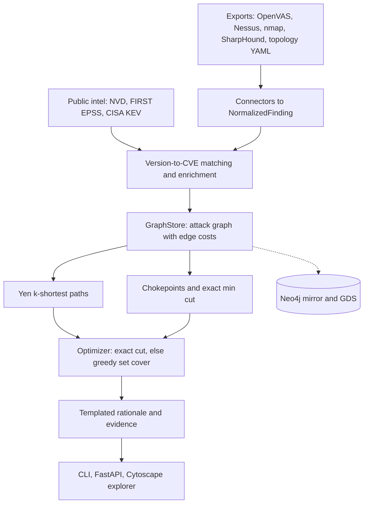
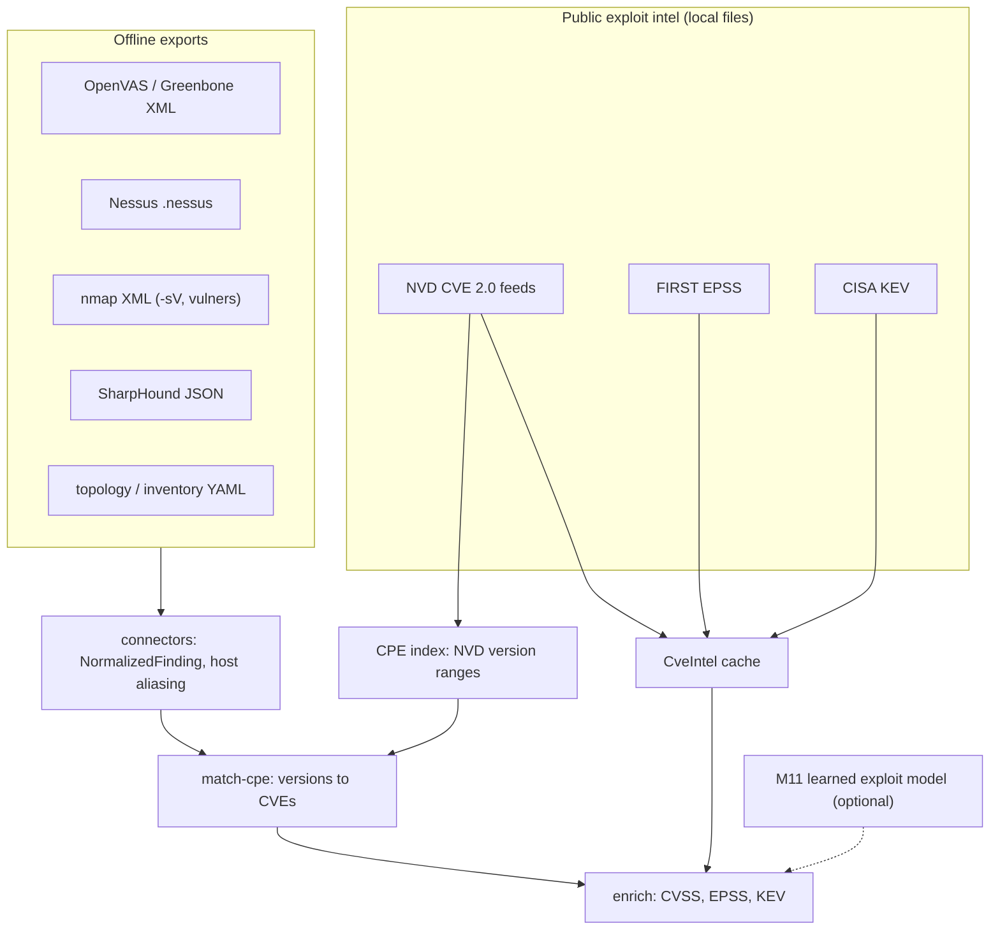
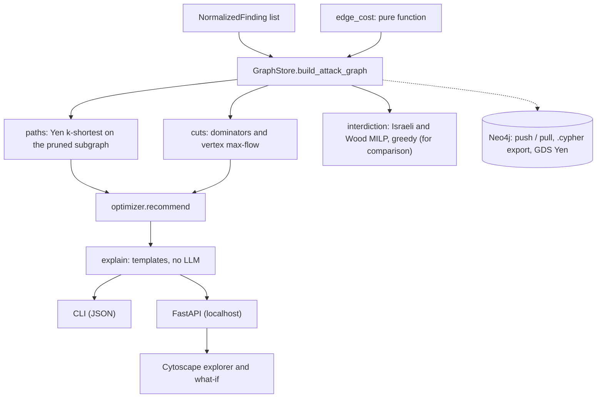
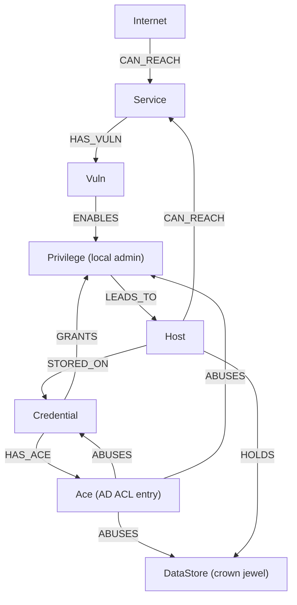

# Architecture

## Overview

The same diagram is in the README.

## Inputs to findings

## Engine and outputs

## Graph model

Edges point in the attacker's direction of travel, so a path is a walk the attacker takes.

Remediable nodes are `Vuln` (patch or upgrade), `Credential` (rotate, clear cached copies), `Ace` (remove the ACL
entry) and non-entry, non-crown `Host` (segmentation rule). The frozen taxonomy lives in
[`contracts/graph_model.md`](https://github.com/rakshit-737/linchpin/blob/main/contracts/graph_model.md);
v1.2 added `Ace`, `HAS_ACE` and `ABUSES`, v1.3 the network-reachability prerequisite of credential use.

## Modules

| Module | Path | Notes |
| --- | --- | --- |
| M1 connectors | `src/linchpin/connectors/` | OpenVAS, Nessus, nmap (+ `vulners`), BloodHound v5/v6 incl. ACEs, inventory overlay, native JSON |
| intel | `src/linchpin/intel/` | NVD 2.0 / EPSS / KEV parsers, 379k-CVE cache, enrichment, offline CPE version matching |
| M2 GraphStore | `src/linchpin/graph/` | NetworkX store; Neo4j push/pull, `.cypher` export, GDS Yen |
| M3 edge cost | `src/linchpin/engine/edge_cost.py` | frozen formula: CVSS exploitability sub-score, EPSS, KEV floor, credential reachability |
| M4 paths | `src/linchpin/engine/paths.py` | Yen k-shortest, kill-chain stages, criticality |
| cuts | `src/linchpin/engine/cuts.py` | dominator chokepoints; min vertex cut by count or by effort |
| interdiction | `src/linchpin/engine/interdiction.py` | exact budgeted interdiction MILP and greedy interdiction (benchmark baselines) |
| M5 optimizer | `src/linchpin/engine/optimizer.py` | exact cut when within budget, else greedy set cover |
| M6 explain | `src/linchpin/engine/explain.py` | deterministic templates, no LLM |
| M7 API / M10 UI | `src/linchpin/api/` | FastAPI with host allow-list and limits; Cytoscape.js explorer (also the static demo) |
| M8 CLI | `src/linchpin/cli.py` | `ingest`, `scenario`, `paths`, `fix`, `cuts`, `whatif`, `export`, `serve`, ... |
| M9 synth | `src/linchpin/synth/` | four topology families using real CVE parameters |
| M11 ML | `src/linchpin/ml/exploitability.py` | KEV-membership model, labels known at the cutoff, exploitation-status text masked |
