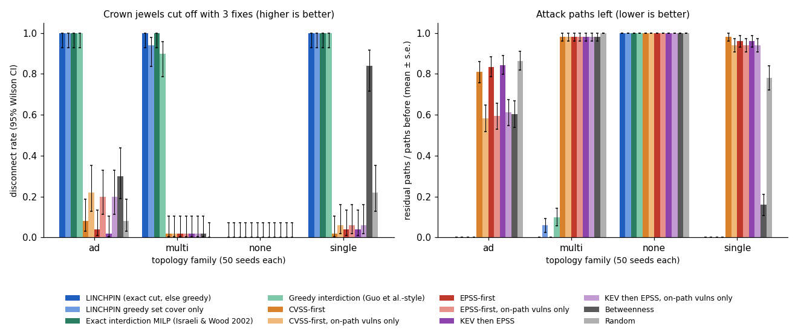

# Evaluation

Every number on this page is produced by a script in `benchmarks/` and written to `benchmarks/results/`; the result
tables below are those files, included verbatim. Everything is seeded and path enumeration does not depend on the
interpreter's hash seed. The rolling feeds are dated in each output (EPSS scores of 2026-09-25, KEV catalog
2026.09.25). Commands and runtimes: [Reproduce](reproduce.md).

## Methodology

**Topology families.** `linchpin.synth.topologies` generates four families, 50 seeds each, with 12 + (seed mod 49)
hosts (12-60 hosts, 58-317 attack-graph nodes):

* `single`: one bastion between the DMZ and everything else (exact min cut 1);
* `multi`: 2-3 parallel bastions and two independent routes into the database (min cut 2, no chokepoint);
* `none`: a flat network whose database exposes several code-execution services (min cut about 7, larger than the
  budget, so no 3-fix plan can disconnect it);
* `ad`: tiered Active Directory with helpdesk local-admin reuse and server-admin and Domain-Admin sessions cached on
  lower tiers (min cut 1.34 on average; half the seeds add a KEV-listed RCE on the domain controller).

Every family also contains **planted distractors**: two isolated hosts with a KEV-listed RCE of CVSS >= 9.0
(decoys nothing can reach) and high-CVSS vulnerabilities without code execution on reachable hosts (noise). They are
what a score-sorted queue spends its budget on, which is why the benchmark also runs the queues restricted to
vulnerabilities that lie on some entry-to-crown-jewel route.

**Vulnerability parameters** come from a KEV-enriched stratified sample of 3,000 real CVEs
(`src/linchpin/synth/data/cve_pool.csv`): NVD vector and exploitability sub-score, EPSS and KEV status. KEV is
deliberately over-represented (10% of the pool against about 0.5% of the source population) so KEV-first queues have
KEV entries to pick.

**Planners** (budget 3 fixes, k = 100 enumerated paths):

| planner | rule |
| --- | --- |
| LINCHPIN | exact minimum vertex cut when it fits the budget, otherwise greedy set cover of the enumerated paths |
| LINCHPIN greedy only | the set cover alone |
| Exact interdiction MILP | Israeli & Wood (2002): maximise the attacker's cheapest-path cost after at most 3 removals (HiGHS) |
| Greedy interdiction | Guo et al.-style: repeatedly remove the node on the cheapest path whose removal raises its cost most |
| CVSS / EPSS / KEV-then-EPSS | highest score first, over all vulnerabilities |
| ... on-path only | the same queues restricted to vulnerabilities on an entry-to-crown-jewel route |
| Betweenness, random | highest cost-weighted betweenness among remediable nodes; uniform random |

**Metrics.** *Disconnect*: no crown jewel reachable afterwards. *Residual paths*: enumerated paths left, as a share of
those before (capped at k). *Cost gain*: rise of the attacker's cheapest-path cost on topologies that stay connected.
*Share of optimal gain*: cost gain divided by the MILP's. *Fixes needed* (ablation): how many of a planner's fixes,
in its own order, the real graph needs before it is disconnected, relative to the exact optimum.

**Statistics.** 95% Wilson intervals for rates; seeded percentile bootstrap (2,000 replicates) for means, not shown
when fewer than 10 topologies contribute; exact two-sided McNemar tests for paired disconnect outcomes on the same
topologies.

!!! note "What the 100% means"
    LINCHPIN plans on the same graph it is scored on, and it returns the exact minimum cut whenever that cut fits the
    budget, so its disconnect rate is 100% by construction wherever a 3-fix cut exists (all of `single`, `multi` and
    `ad`). The benchmark measures how far *other* planners are from that optimum inside LINCHPIN's attack-graph
    model, not real-world risk; the ablation measures what happens when the planner's data is incomplete.

## Synthetic benchmark

--8<-- "benchmarks/results/summary.md"

## Ablation

--8<-- "benchmarks/results/ablation.md"

## Measured case study (CI lab scan)

The `lab-scan` CI job starts official Docker images pinned to older releases (httpd 2.4.49, nginx 1.16.1,
tomcat 9.0.30, redis 5.0.7, mysql 5.5.62) on two networks created with `--internal`, so nothing in them can reach the
internet or the runner's other networks. A scanner container inside each network runs `nmap -sV` (service/version
detection only; no NSE scripts, no exploitation) against those containers alone. `benchmarks/lab_case_study.py`
derives hosts, segments and firewall rules from the measurement (`app` is the only container on both networks),
declares the two facts a scan cannot see (the `lp-dmz` network faces the internet; `db` holds the crown jewel), maps
the detected versions to CVEs offline and plans. The job fails if any check below fails. Scans from CI run
[36999203784](https://github.com/rakshit-737/linchpin/actions/runs/36999203784); replay with
`python benchmarks/lab_case_study.py --scans benchmarks/results/lab` or
`linchpin scenario scenarios/lab_scan.yaml --data-dir .`.

--8<-- "benchmarks/results/lab/lab_case_study.md"

A version banner is not proof of exposure: backported fixes and configuration are invisible to it, so the CVE lists
are an upper bound and the plan is "upgrade these services", not a claim that each CVE is exploitable in the lab.

## Real-export case study (declared topology)

Real findings and intel (an OpenVAS scan of Metasploitable 2, a Greenbone report of a Windows Server 2019 host, a
Nessus scan of `testphp.vulnweb.com`, two nmap exports, and the SharpHound `TESTLAB.LOCAL` collection including its
ACEs), placed into a **declared** topology (`scenarios/composite_lab.yaml`) because the public exports come from
unrelated networks. Crown jewel: the NTDS database on the domain controller.

--8<-- "benchmarks/results/case_study.md"

## Reproduction: EPSS vs CVSS (Jacobs et al. 2023)

--8<-- "benchmarks/results/repro_epss.md"

**Reading.** On the population the paper used (CVEs published by 2022-12-01 with an NVD CVSS v3 score) the CVSS
effort column reproduces almost exactly (58.2% vs 58.1% for CVSS 7+, 15.0% vs 15.1% for CVSS 9.1+), and with the
EPSS scores that were actually published on that date (model v2022.01.01, i.e. EPSS v2) effort and coverage of the
paper's EPSS v2 cells reproduce within ~2-8 points (CVSS 7+ coverage 89.6% vs 82.1%; the EPSS row is matched to our own ~90% CVSS 7+ coverage) with KEV as the label (40.8% vs 39.0% effort at CVSS 7+ coverage,
71.4% vs 69.9% coverage at CVSS 9.1+ effort), but efficiency does not (1.6% vs 8.9%; 3.4% vs 18.5%) because KEV
(854 positives) is a much sparser label than the paper's exploitation telemetry. The paper's headline "one-eighth of the effort" uses EPSS v3, which was not published before
March 2023 and cannot be scored retroactively from public data, so it is not reproduced. Against KEV on the scoring
date EPSS is partly circular (EPSS uses KEV as an input feature); against the 62 CVEs added to KEV in the following
year it still covers 53% of them at 15% effort, against 29% for CVSS 9.1+, but with 62 positives the marginal intervals touch ([42, 65] vs [18, 42]) and no paired test has been run. LINCHPIN's own exploitability blend is a
worse global ranker than EPSS (68.8% effort for CVSS 7+ coverage): its job is the edge cost inside a path, not
global triage.

## Learned exploitability (M11)

--8<-- "benchmarks/results/ml_exploitability.md"

## Neo4j GDS cross-check

The `neo4j-gds` CI job loads seeded `single` topologies into Neo4j 5.26.31 Community with the Graph Data Science
2.13.13 plugin (the official image's entrypoint fetches the jar from Neo4j's plugin host), runs
`gds.shortestPath.yens` from the entry point to the crown jewel, and compares with the NetworkX engine on the same
graph (`benchmarks/results/gds_crosscheck.json`, CI run
[36999203784](https://github.com/rakshit-737/linchpin/actions/runs/36999203784)). Costs and the paths strictly
cheaper than the k-th agree in every case; the job fails if the plugin is missing.

| hosts | nodes / relationships | k | Yen in NetworkX (median of 3) | Yen in GDS (median of 3) | mirror into Neo4j |
| ---: | ---: | ---: | ---: | ---: | ---: |
| 250 | 1,131 / 60,040 | 10 | 0.157 s | 0.028 s | 10.8 s |
| 250 | 1,131 / 60,040 | 100 | 0.832 s | 0.206 s | 7.9 s |
| 500 | 2,246 / 238,665 | 10 | 0.579 s | 0.018 s | 20.1 s |
| 500 | 2,246 / 238,665 | 100 | 2.623 s | 0.299 s | 22.1 s |

GDS answers Yen 4-31x faster, but only pays off when the graph already lives in Neo4j: mirroring it costs more than
the NetworkX computation it replaces.

## Performance

Build + rank (k=10) + optimise (budget 5, k=100), median of 5 runs on an idle laptop (i5-13500H, Python 3.14):
1.10 s at 467 nodes / 9.8k edges (`single`) and 0.92 s at 373 nodes (`ad`), so the spec's "< 5 s at 500 nodes" holds;
3.1 s at 903 nodes, 7.0 s at 1,384 nodes / 89k edges. The optimiser time includes one exact min cut; a standalone
min cut takes 0.2-1.6 s in this range. Timings on this laptop vary by up to about 1.6x between sessions (another
median-of-3 session measured 1.76 s at 467 nodes); A/B runs of the v1.0 and current code on the same graphs differ by
under 6%. Raw rows and the platform: `benchmarks/results/scale.json`.

## Threats to validity

* **Synthetic families are the project's own.** Their structure (bastions, parallel pivots, flat networks, AD tiers)
  decides how often a small cut exists. Results transfer to real networks only as far as these shapes do.
* **Scored inside the model.** Disconnection and cost are computed on LINCHPIN's attack graph with its edge costs;
  a real attacker is not bound by them. The ablation and the measured lab partly address this, the declared case
  study does not.
* **Planted distractors** inflate how badly the plain score queues do; the on-path variants remove that advantage and
  are the like-for-like comparison.
* **KEV is a proxy label** (for the reproduction and M11): a small, curated subset of exploitation in the wild.
* **The measured lab is small** (5 containers, 2 networks) and its CVE lists come from version banners.
* **Residual paths are capped at k**, so the residual metric saturates on dense graphs; disconnect rate and cost gain
  do not.
