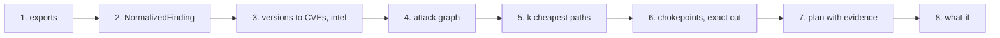
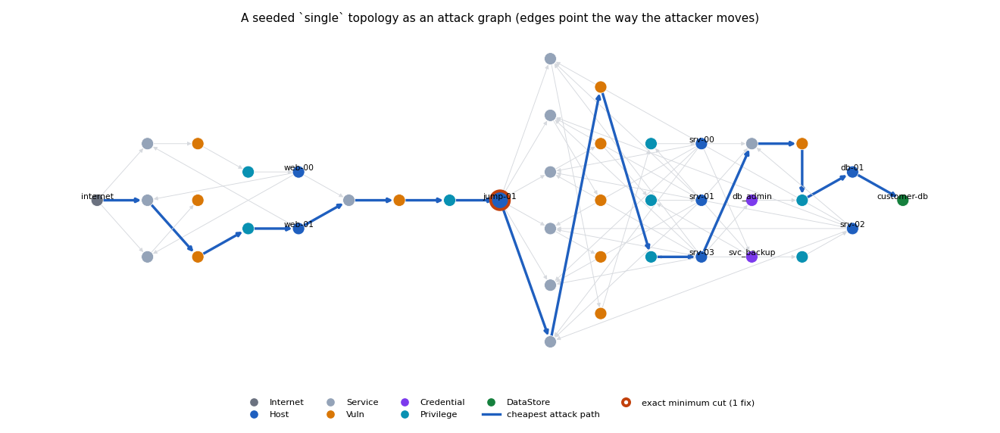
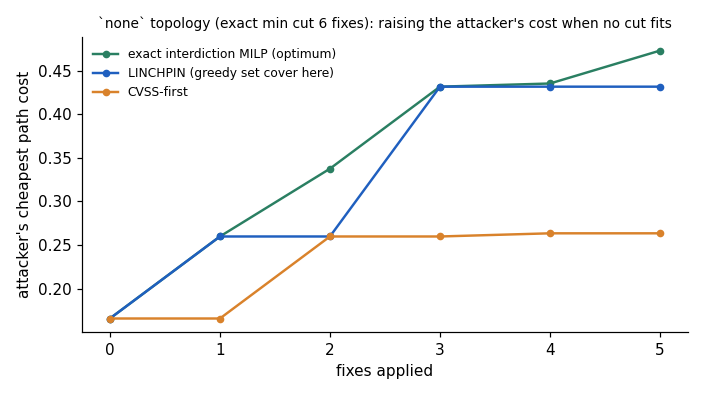

# How it works

This page follows one seeded synthetic topology (`linchpin synth --family single --hosts 8 --seed 0`) through every
stage. Each step names the module that implements it; the figures come from `scripts/make_figures.py`.



## 1. Exports, never targets

LINCHPIN only reads files that already exist: OpenVAS / Greenbone and Nessus XML, nmap `-oX` (with or without the
`vulners` script), SharpHound/BloodHound JSON, a topology YAML, or native JSON. A connector per format
(`linchpin.connectors`) detects the format and parses it with `defusedxml`. Nothing is ever sent to a host.

## 2. One schema for every source

Every connector emits the frozen `NormalizedFinding` contract (`contracts/finding.schema.json`): kinds `cve`,
`service`, `credential`, `acl`, `config` and `reachability`. Records that fail the schema, or whose kind-specific
`detail` is unusable (for example a credential without a principal), are dropped and logged. One finding from the
example topology, a vulnerable SSH service on the jump host:

```json
{"finding_id": "308e10ec63c17ab4", "host_id": "jump-01", "kind": "cve", "cve_id": "CVE-2015-4887",
 "cvss_base": 6.0, "cvss_vector": "AV:N/AC:M/Au:S/C:P/I:P/A:P", "epss": 0.01434, "port": 22,
 "detail": {"impact_class": "rce", "kev": false, "cvss_exploitability": 0.68},
 "source": "synth", "observed_at": "2026-01-01T00:00:00+00:00"}
```

Scanner host ids are merged onto the topology's host ids through the `match:` lists of the topology YAML, so the
nmap, OpenVAS and BloodHound views of one machine become one node.

## 3. Versions to CVEs, then exploit intel

When a scan only reports product versions (`nmap -sV`), `linchpin ingest --match-cpe` maps them to CVEs **offline**
with an index of NVD's version ranges (`linchpin.intel.cpe`, built by `scripts/build_cpe_index.py`), one finding per
service: the fix is an upgrade. Findings are then enriched from the local NVD / EPSS / KEV cache
(`linchpin intel-build`): CVSS vector and exploitability sub-score, EPSS, KEV status.

Only vulnerabilities whose CVSS vector implies code execution (network-reachable, integrity High) grant a privilege;
KEV entries always do. That gate is why a CVSS 10 information leak does not open a path.

## 4. The attack graph

`GraphStore.build_attack_graph` (`linchpin.graph.store`) turns the findings into a directed graph whose edges point
the way an attacker moves: `Internet/Host -CAN_REACH-> Service -HAS_VULN-> Vuln -ENABLES-> Privilege -LEADS_TO-> Host`,
`Host -STORED_ON-> Credential -GRANTS-> Privilege`, `Host -HOLDS-> DataStore`, plus abusable AD ACLs
(`Credential -HAS_ACE-> Ace -ABUSES-> ...`). Same-segment hosts reach each other; across segments only the declared
(or, in the CI lab, measured) firewall rules apply.

Every edge carries a deterministic cost in [0, 1], lower meaning easier (`contracts/edge_cost.md`):

    cost = w1 (1 - exploitability) + w2 (1 - prerequisite_match) + w3 skill_penalty      (w = 0.5, 0.3, 0.2)

For the SSH vuln above, exploitability = 0.6 x 0.68 (CVSS sub-score) + 0.4 x 0.01434 (EPSS) = 0.4137, so its
`ENABLES` edge costs 0.5 x 0.5863 + 0 + 0.2 x 0.1 = **0.313**. KEV entries are floored at exploitability 0.95, and a
credential whose target is not network-reachable from where it is stored pays `prerequisite_match` 0.5.



The example graph has 49 nodes and 77 edges (the two unreachable decoy hosts are not drawn).

## 5. The k cheapest attack paths

`GraphStore.k_shortest_paths` prunes the graph to nodes that are reachable from an entry point *and* can reach a crown
jewel, adds a virtual source and sink, and runs Yen's algorithm (`networkx.shortest_simple_paths`). Each hop gets a
kill-chain stage from its edge type. The cheapest path here, abridged:

    internet -> web-01:443 -> CVE-2026-10520 (web-01) -> host web-01 -> jump-01:22 -> CVE-2015-4887 (jump-01)
             -> host jump-01 -> srv-03:445 -> CVE-2022-24165 (srv-03) -> db-01:1433 -> ... -> ds:customer-db
    cost 0.592, 17 hops; the next two cost 0.597 and 0.647

## 6. Chokepoints and the exact minimum cut

`linchpin.engine.cuts` computes two exact quantities over the *remediable* nodes (vulns, credentials, ACEs and
non-entry hosts):

* **chokepoints**: nodes on every entry-to-crown-jewel route, from the dominator tree of the virtual source
  (here: the SSH vuln on `jump-01` and the host `jump-01` itself);
* **the minimum remediation cut**: the fewest fixes that disconnect every crown jewel, from a vertex-split max-flow /
  min-cut. With `--weighted` it minimises effort instead (a segmentation rule costs 3 patches).

## 7. A plan with evidence

`recommend` (`linchpin.engine.optimizer`) uses the exact cut when it fits the budget and otherwise a greedy set cover
of the enumerated paths, so the plan both disconnects with the fewest fixes when that is possible and keeps a
"most paths broken first" order. Every fix carries a templated rationale (no LLM) and the ids of the paths it breaks:

> host:jump-01 (segment mgmt) is the only pivot from dmz to internal; add segmentation rule isolating jump-01 breaks
> 100/100 enumerated attack paths to ds:customer-db.

## 8. What-if, and what to do when no cut fits

`whatif` removes nodes without changing the store: removing `host:jump-01` takes the enumerated paths from 100 to 0
and leaves no crown jewel reachable. When the minimum cut is larger than the budget (the `none` family needs about
7 fixes), no plan can disconnect, and what matters is how much the fixes raise the attacker's cheapest path. The
figure compares LINCHPIN's fallback with the optimum from the exact interdiction MILP of Israeli & Wood (2002) and
with CVSS-first on one such topology; over 50 seeds LINCHPIN reaches 0.83 [0.77, 0.88] of the optimal rise
([Evaluation](evaluation.md#synthetic-benchmark)).



## Outputs

The same engine serves the CLI (`linchpin paths / fix / cuts / whatif / node`, JSON on stdout), the FastAPI service
and the Cytoscape.js explorer (`linchpin serve`, localhost only), a Neo4j mirror (`neo4j-push`, `.cypher` export) and
the GDS backend for Yen's algorithm inside Neo4j.
