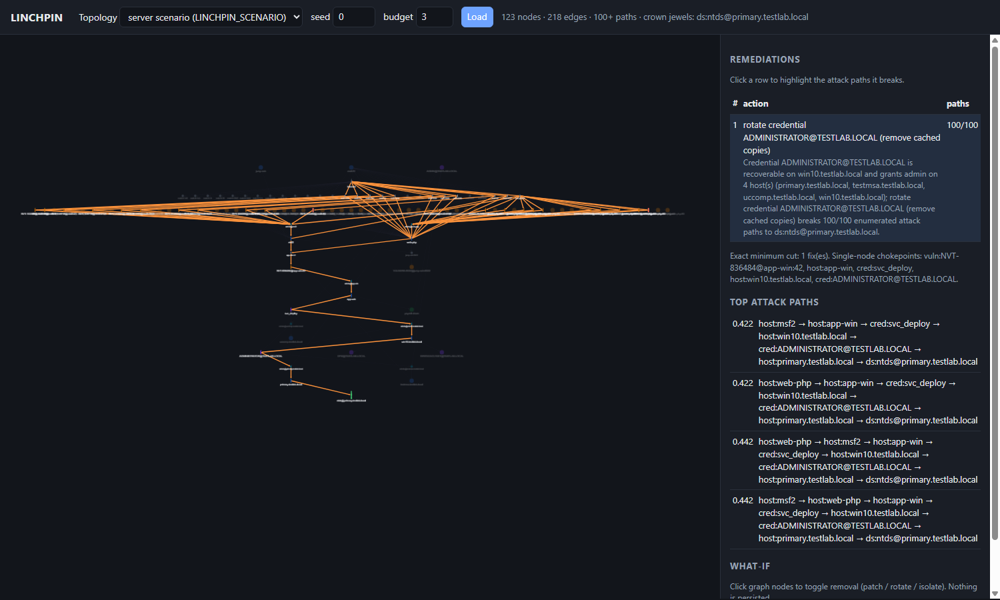

# LINCHPIN

**Read-only attack-path reasoning: find the few fixes that cut every route to the crown jewels, using scanner, identity and exploit-intel data.**

!!! abstract "Contribution, in one sentence"
    Inside its seeded attack-graph model, LINCHPIN measures which data a fix plan needs: on synthetic topologies whose
    routes run through cached credentials, adding identity (BloodHound) data lifts 3-fix disconnection from 5/100 to
    100/100.

The minimum vertex cut itself is classical (minimum-cost network hardening has been studied since Noel et al. 2003
and Wang, Noel & Jajodia 2006), and so is fusing scanner and firewall data into attack graphs (TVA 2005, NetSPA 2006,
CyGraph 2016). What LINCHPIN adds is the Active Directory identity layer in that fusion, evidence-carrying fix plans,
and an open, seeded evaluation with an ablation, published-method baselines and a measured lab. See
[Evaluation](evaluation.md) for methods and every number. These are results inside LINCHPIN's model: the identity
result is built into the families (only `ad` and `multi` route through cached credentials; pooled with `single`, the
rate without identity data is 37% [29, 45]).

| claim | result [95% interval] | paired test | source | run / commit |
| --- | --- | --- | --- | --- |
| Identity data decides whether 3 fixes cut credential-routed topologies off (`ad` + `multi`, n = 100) | with it 100/100 [96, 100]; without it 5/100 [2, 11]; identity data alone 27/100 [19, 36] | exact McNemar, 95 vs 0 discordant, p < 1e-4 | [ablation](evaluation.md#ablation) | CI [37089520295](https://github.com/rakshit-737/linchpin/actions/runs/37089520295) |
| Published planners reach the same rate (n = 150) | exact interdiction MILP (Israeli & Wood 2002) 100% [98, 100]; Guo et al.-style greedy interdiction 97% [92, 99]; best patch-only plan 95% [90, 97] | vs LINCHPIN: 0 vs 0 (p = 1), 5 vs 0 (p = 0.0625), 8 vs 0 (p = 0.0078) | [benchmark](evaluation.md#synthetic-benchmark) | CI [37089520295](https://github.com/rakshit-737/linchpin/actions/runs/37089520295) |
| Score-sorted patch queues do no better than chance (n = 150) | CVSS / EPSS / KEV-then-EPSS queues over on-path vulns 10% [6, 16] / 9% [6, 15] / 9% [6, 15]; no better than a uniformly random choice of 3 remediable nodes (10% [6, 16]); betweenness 39% [31, 47] | vs random: 10 vs 10, 9 vs 10, 9 vs 10 (p = 1 each) | [benchmark](evaluation.md#synthetic-benchmark) | CI [37089520295](https://github.com/rakshit-737/linchpin/actions/runs/37089520295) |
| Measured lab (CI scan, internal Docker networks; n = 1 lab) | upgrading Tomcat 9.0.30 (1 fix) cuts the database off; betweenness, greedy and MILP also need 1; EPSS- and KEV-first 2, CVSS-first 3 | none (one lab) | [lab scan](evaluation.md#measured-case-study-ci-lab-scan) | CI [37091866743](https://github.com/rakshit-737/linchpin/actions/runs/37091866743) |
| Partial replication of Jacobs et al. (2023) with public data (EPSS v2, KEV label, 117,141 of their ~191k CVEs) | effort within 2 points in all four rows, coverage within 1.5-7.5 points; effort ratio EPSS / CVSS 7+ at equal coverage 0.701 [0.695, 0.824] vs the paper's 0.671 (outside); efficiency does not reproduce (1.6% vs 8.9%) | - | [reproduction](evaluation.md#reproduction-epss-vs-cvss-jacobs-et-al-2023) | commit 22b77b5 |
| Prospective label (62 CVEs added to KEV in the next year) | at 14.9% effort EPSS v2 33/62 = 53% [41, 65], CVSS 9.1+ 18/62 = 29% [19, 41] | 20 vs 5 discordant, exact McNemar p = 0.0041; +24.2 points, paired bootstrap [9.7, 38.7] | [reproduction](evaluation.md#reproduction-epss-vs-cvss-jacobs-et-al-2023) | commit 22b77b5 |

## Try it in 60 seconds

=== "In the browser"

    [Open the path explorer](demo/index.html){ .md-button .md-button--primary } - runs from pre-computed snapshots,
    nothing leaves the page.

=== "Command line (uv)"

    ```bash
    uv tool install git+https://github.com/rakshit-737/linchpin@v1.1.0   # the v1.1.0 release, once
    linchpin synth --out lab.json   # seeded topology, real CVE parameters
    linchpin ingest --replace lab.json
    linchpin fix --budget 3
    # -> "add segmentation rule isolating jump-01 ... breaks 100/100 enumerated attack paths to ds:customer-db"
    ```

=== "Web UI (Docker)"

    ```bash
    git clone https://github.com/rakshit-737/linchpin && cd linchpin
    docker build -t linchpin . && docker run --rm -p 127.0.0.1:8000:8000 linchpin   # http://127.0.0.1:8000/ui
    ```


*The explorer on the real-export case study: the top fix (rotate the cached Domain-Admin credential) is selected and
every attack path it breaks is highlighted.*

## What it does

LINCHPIN reads exports that were **already collected** (OpenVAS, Nessus and nmap reports, SharpHound/BloodHound JSON,
and a topology/inventory overlay), maps detected versions to CVEs offline, enriches them with NVD CVSS vectors,
FIRST EPSS and CISA KEV, and builds a heterogeneous attack graph. From that graph it:

1. enumerates and ranks entry-to-crown-jewel attack paths (Yen's k-shortest paths),
2. finds **chokepoints** (dominators) and the **exact minimum remediation cut** (vertex max-flow), optionally weighted
   by remediation effort,
3. recommends an ordered, budgeted set of fixes (patch or upgrade, rotate a credential, remove an abusable AD ACL, add
   a segmentation rule), each with a templated rationale and the ids of the attack paths it breaks,
4. serves this through a CLI, a FastAPI service, a Cytoscape.js path explorer with what-if analysis, and an optional
   Neo4j mirror with a Graph Data Science backend.

**Safety property:** LINCHPIN sends no packets and only parses files. It cannot exploit anything. See
[Security](security.md) and the [Threat model](threat-model.md).

## More results

| evaluation | result [95% interval], paired test | run / commit |
| --- | --- | --- |
| No cut within budget (`none` family, n = 50) | LINCHPIN reaches 0.83 [0.77, 0.88] of the optimal (MILP) rise in the attacker's cheapest-path cost, KEV-then-EPSS 0.15 [0.09, 0.22]; paired gain difference +0.156 [0.130, 0.182], sign test p < 1e-4 | CI 37089520295 |
| Exploit-intel edge costs (ablation, `none`) | the fused plan's cost gain beats the uniform-cost plan's by +0.144 [0.119, 0.168] when scored with the intel costs, and trails it by 0.054 [0.027, 0.082] when scored with uniform costs: the gap depends on the scoring costs | CI 37089520295 |
| Attack paths left after 3 fixes | difference in the share of enumerated (k-capped) paths left, CVSS-first minus LINCHPIN: 92 percentage points [88, 96] over the 150 topologies with a 3-fix cut | CI 37089520295 |
| Real-export case study (declared topology) | one credential rotation cuts the domain controller off, as do the MILP, greedy interdiction and betweenness within 3 fixes; enriched CVSS / EPSS / KEV queues with 3 fixes do not. Planned without the identity findings (the ablation's `no_identity` view), LINCHPIN sees no attack path at all and proposes no fix, while the domain controller stays reachable (200/200 enumerated paths). | commit e26d0b1 |
| Learned exploitability (temporal split; label and phrase leakage removed) | ROC-AUC 0.836 [0.820, 0.852] vs 0.754 [0.739, 0.772] for CVSS base score; average precision 0.028 [0.024, 0.034] vs 0.011 [0.010, 0.014]. Paired on the same resampled CVEs: AUC difference +0.082 [0.065, 0.100], average-precision ratio 2.43x [1.90, 3.24]. | commits 552d969, 094ef62 |
| Neo4j GDS cross-check (CI) | identical costs and path sets on graphs of 60,040 and 238,665 relationships; Yen inside Neo4j is 4.8x / 8.1x faster at 250 hosts (k = 10 / 100) and 39x / 12x at 500 hosts (medians of 10 timed runs; 1.4-39x across the four CI runs that measured it), but mirroring the graph into Neo4j takes 5-15 s | CI [37091866743](https://github.com/rakshit-737/linchpin/actions/runs/37091866743) |

Details, intervals and caveats: [Evaluation](evaluation.md). Every command and runtime: [Reproduce](reproduce.md).
